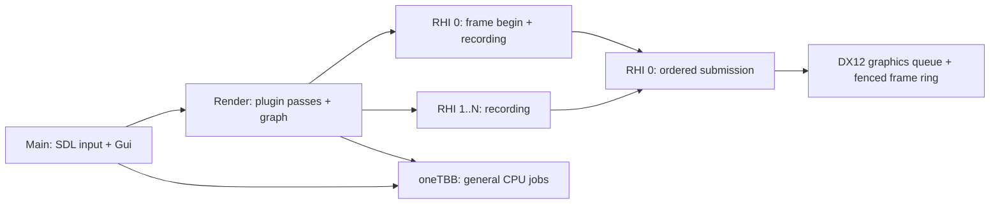

# Architecture and extension contracts

## Frame ownership

Main waits for CPU frame completion before editing the next settings snapshot. GUI data is deep-copied before it reaches Render/RHI. This first version does not overlap Main and Render frames. GPU resource lifetime uses a separate two-frame fence ring; CPU frame completion does not imply GPU completion.

RHI frame control/resource creation belongs to RHI 0. Recording can happen concurrently in distinct contexts; each context can be used once per frame. Submitted draw packets keep their buffers, textures and pipelines alive until the associated fence completes. Resize and shutdown drain the graphics queue. Geometry uses immutable upload buffers, and the font uses a default-heap texture with staging upload.

Task handles carry completion and exceptions. Dependencies are continuation driven and do not occupy waiting workers. Worker waits use oneTBB resumable tasks; a waiting worker can run a child even with one worker configured. Main waits pump Main jobs. Waiting for unfinished work on the same dedicated Render/RHI queue is rejected. Cross-domain cyclic waits are a caller error, not an automatically solved dependency graph. Stop task producers before shutdown. Tracy scopes must not span a resumable worker wait because resumption can migrate between OS threads.

## Adding an experiment

1. Create a `RenderPlugin` in `plugins/<name>` and register its stable ID/factory in the application registry. Declare dependencies on other logical plugins where required.
2. Compile shaders through `ShaderCompiler`, using Worker tasks for CPU compilation, and create resources through `RhiDevice` on RHI 0 in `start()`.
3. In `build()`, contribute `ColorPass` commands using owned draw packets. A Load pass depends on previously initialized color contents. The graph inserts transitions and presentation automatically.
4. Release owned handles in `stop()` after the application drains GPU work. Add the ID to an experiment configuration and restart.

The current graph is explicitly a swapchain color graph. An offscreen GI algorithm will need a future change introducing graph resource handles, textures/formats/usages and read/write tracking across multiple resources. Do not bypass RHI to add native graphics calls in a plugin.

## Reflection, allocation and dependency boundaries

Reflection descriptors expose stable property IDs, kinds, ranges, getters and setters. JSON serialization uses a type ID and schema version. Unknown properties are ignored, missing properties preserve defaults, and incompatible future versions fail. GPU handles are never serialized; persistent assets store identity and source paths.

`allocate` / `deallocate` must be paired, with a power-of-two alignment and a `MemoryTag`. A `MemoryResource` adapts these hooks to PMR containers. There is no global `new` override; allocator replacement remains local to the core adapter. Third-party allocators are hooked where supported, without claiming full process coverage.

Vendor includes and calls live in `src/adapters`. Public types are owned by Hyperion, and CMake links vendors privately. The include checker catches direct includes; code review must also reject copied vendor aliases or native handles leaking into public contracts. `NativeSurface` carries the platform's opaque surface token solely for backend initialization.

## Shader contract

Sources use HLSL with column-major matrices and column-vector multiplication. DXC emits shader model 6.0 DXIL or Vulkan 1.1 SPIR-V; SPIRV-Cross supplies resource metadata and MSL source. Space 0 currently maps b-registers directly, t-registers to binding 1000+, s-registers to 2000+, and u-registers to 3000+ to keep Vulkan bindings distinct. Current engine reflection exposes uniform buffers, separate textures and samplers; storage buffers/images and other spaces require extending this contract.

SHA-256 cache keys include a wrapper revision, pinned DXC/SPIRV-Cross identity, entry/stage/format and every file under the configured shader root. Includes must stay inside this root. Source-tree invalidation is deliberately conservative. Cache files carry an integrity digest; corrupt or incomplete files are recompiled. Shader compilation is serialized per compiler instance. MSL output is source generation evidence, not Metal runtime validation.

## GUI contract

The generic `Gui` wrapper owns ImGui/ImPlot contexts on Main. It accepts normalized engine input and exposes controls, reflected property editing, plotting and owned draw data. The initial backend uses a static font atlas; only that texture ID and reset-render-state callbacks are supported. The debug rendering plugin owns its RHI font/pipeline, converts copied vertices/indices to buffers and contributes a color Load pass. Large vertex offsets and framebuffer-scaled scissor rectangles are preserved.

Native windowing, graphics and shader runtime loading currently target Windows/MSVC x64. Cross-platform APIs are extension points, not claims of tested portability.
