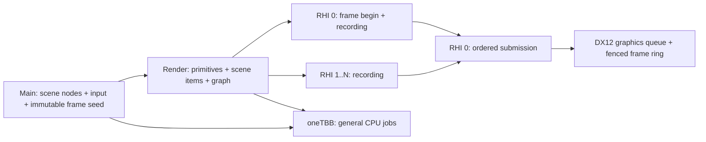
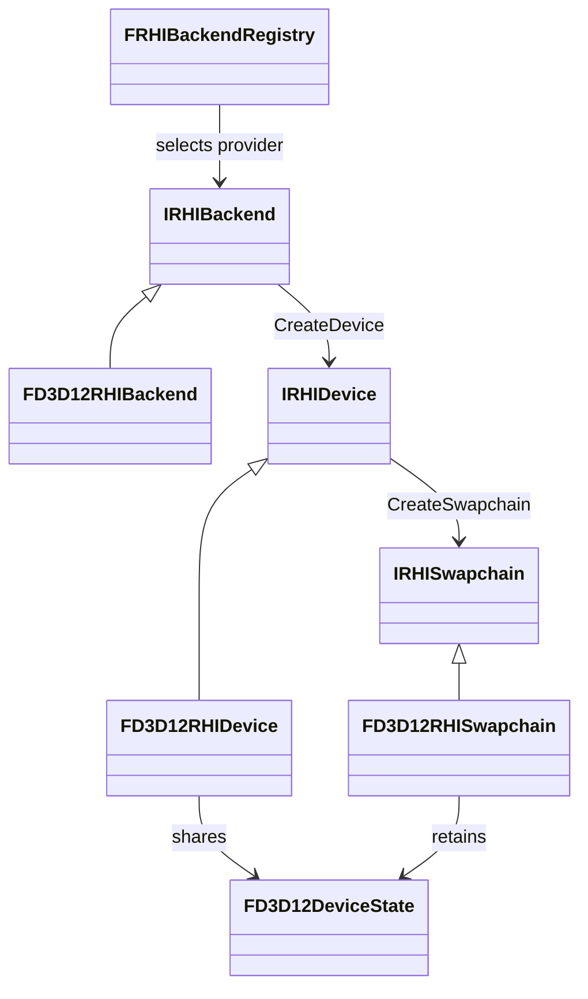

# Architecture and extension contracts

## Frame ownership

Main publishes owned settings and scene-frame snapshots; GUI data is deep-copied before it reaches Render/RHI. FFramePipeline independently bounds Main→Render and Render→RHI lead, both defaulting to 1. Main and Render may overlap different CPU frames; zero lead provides serialized operation. Resize and shutdown drain admitted work. See [CpuFramePipeline.md](CpuFramePipeline.md). GPU resource lifetime uses a separate two-frame fence ring; CPU frame completion does not imply GPU completion.

RHI frame control/resource creation belongs to RHI 0. Recording can happen concurrently in distinct contexts; each context can be used once per frame. Submitted draw packets keep their buffers, textures and pipelines alive until the associated fence completes. Resize and shutdown drain the graphics queue. Geometry uses immutable upload buffers, and the font uses a default-heap texture with staging upload.

If recording or frame ending fails, graph execution joins every admitted recorder and calls `IRHISwapchain::CancelFrame` on RHI 0 before propagating the original error. Cancellation is idempotent. Unsubmitted commands are abandoned; submitted work must finish before its resources are released. A healthy device can begin another frame after successful cancellation; a failure to drain the device remains an error.

Each `FWindow` owns a balanced SDL video/events subsystem reference. Destroying one window leaves other windows usable; the last reference releases its subsystem ownership. Event routing remains the current single-window polling model.

Viewer and Editor run as `FViewerPlugin` and `FEditorPlugin` inside the shared `FApplicationHost`. Asset, window, graphics/session and GUI services are dependency-ordered logical plugins. The host owns only Tasks, the Main pump, clock and exit state. RenderDoc uses optional ordering edges before windows/devices. Quiesce joins admitted frames before reverse-order shutdown; file producers join before IO/task services are destroyed and native graphics objects are released on RHI 0. See [PluginSystem.md](PluginSystem.md) for selection, typed services and scoped events.

Task handles carry completion and exceptions. Dependencies are continuation driven and do not occupy waiting workers. Worker waits use oneTBB resumable tasks; a waiting worker can run a child even with one worker configured. Main waits pump Main jobs. Waiting for unfinished work on the same dedicated Render/RHI queue is rejected. Cross-domain cyclic waits are a caller error, not an automatically solved dependency graph. Stop task producers before shutdown. Engine profiling scopes close before a resumable Worker wait and reopen their execution segments after resumption, retaining task IDs and annotations even if the OS thread changes. Dedicated blocking waits retain wall-time scopes. These segments still include OS preemption; they are not pure on-CPU sampling. See [Profiling](Profiling.md).

## Scene rendering

[RenderPrimitives.md](RenderPrimitives.md) defines the standard runtime flow, message and lifetime contracts. Main logical objects hold opaque bindings; Render owns persistent primitives and collects independent frame items. A device/session resource service shares immutable geometry/materials and retires native handles on RHI 0 after uploads, frame references and GPU fences permit it. Control and retirement progress continue without new presented frames.

Scene-backed viewers own FSceneInstance on Main. Authored cameras and lights are scene nodes; the bridge publishes geometry and metadata under one exact publication token. Render resolves an immutable scene-frame seed through FSceneViewRequest. Application code must not reconstruct a bound frame by copying public material inputs. Editor and SceneViewer use CameraOverride for independent browsing views initialized from optional InitialView metadata or deterministic framing. Editor camera preview resolves an explicit scene handle with fallback disabled; ModelViewer retains its authored-camera workflow. Reusable navigation is provided by FSceneCameraController; see [SceneManagement.md](SceneManagement.md).

## Adding an experiment

1. Scene producers implement `IScenePlugin` in `Source/Plugins/<Name>` and register a stable ID/factory in the application registry. `Start`, `Update` and `Stop` run on Main.
2. Request immutable geometry/material resources from the session service, supplying complete identity/version/configuration. CPU preparation runs on Worker and native resource production runs on RHI 0.
3. Register primitives and submit owned state snapshots through bindings. The runtime session collects and renders them; the plugin does not submit model/triangle passes. Camera and settings enter the frame as owned values.
4. Release bindings in `Stop`; close the render session before destroying graphics and task services. Ordinary object removal uses asynchronous retirement without a device idle wait.
5. Register `IRenderFeature` factories for Render-stage contributions, or subscribe to `FGuiPanelEvent` for Main GUI contributions. Deferred pass preparation captures owned state; graph Load passes still require initialized color contents. The older `IRenderPlugin::Build` remains a direct-call compatibility interface, not an automatic host dispatch hook.

The graph imports explicit texture mips/buffers, tracks read/write dependencies and supports sampled offscreen targets, multiple color attachments and compute dispatches. Viewer uses the shared HDR scene pipeline: Deferred GBuffer lighting or HDR Forward, CSM, requested HZB/contact shadows, clustered local lights, sky/IBL, transparency, tonemapping and GUI. Transient aliasing and multi-queue scheduling remain unimplemented. See [RenderGraph.md](RenderGraph.md), [ComputePipelines.md](ComputePipelines.md) and [DeferredRendering.md](DeferredRendering.md). Do not bypass RHI to add native graphics calls in a plugin.

## Reflection, allocation and dependency boundaries

See [AssetPipeline.md](AssetPipeline.md) for the single IO thread, resumable worker import, reflected `.hasset` records, immutable Scene assets, asynchronous fenced texture upload and the supported glTF boundary. Existing configuration reflection remains compatible; `FRecordDescriptor` adds nested data and bulk serialization without exposing GPU or vendor objects.

Record reflection exposes stable property IDs, typed value shapes, validation and optional Inspector metadata. Scene objects compose registered value components; inspection drafts validate detached candidates before scene transactions. See [SceneComponents.md](SceneComponents.md). Configuration descriptors also expose their existing property getters/setters. JSON serialization uses a type ID and schema version. Unknown properties are ignored, missing properties preserve defaults, and incompatible future versions fail. GPU handles are never serialized; persistent assets store identity and source paths.

`Allocate` / `Deallocate` must be paired, with a power-of-two alignment and a `EMemoryTag`. A `FMemoryResource` adapts these hooks to PMR containers. There is no global `new` override; allocator replacement remains local to the core adapter. Third-party allocators are hooked where supported, without claiming full process coverage.

Vendor includes and calls live in each runtime module's `Private/Adapters`, or a native backend's `Private` directory. Public types are owned by Hyperion, and CMake links vendors privately. The include checker catches direct includes; code review must also reject copied vendor aliases or native handles leaking into public contracts. `FNativeSurface` carries the platform's opaque surface token solely for backend initialization.

## Shader contract

Sources use HLSL with column-major matrices and column-vector multiplication. DXC emits shader model 6.0 DXIL or Vulkan 1.1 SPIR-V; SPIRV-Cross supplies resource metadata and MSL source. Space 0 maps b-registers directly, t-registers to binding 1000+, s-registers to 2000+, and u-registers to 3000+ to keep Vulkan bindings distinct. The mapping applies independently to register spaces 0–3. Engine reflection supports uniform buffers, Texture2D/TextureCube resources, samplers, structured/raw SRVs and UAVs, storage textures and compute thread-group sizes. The D3D12 backend executes both graphics and compute pipelines.

SHA-256 cache keys include a wrapper revision, pinned DXC/SPIRV-Cross identity, entry/stage/format and every file under the configured shader root. Includes must stay inside this root. Source-tree invalidation is deliberately conservative. Cache files carry an integrity digest; corrupt or incomplete files are recompiled. Shader compilation is serialized per compiler instance. MSL output is source generation evidence, not Metal runtime validation.

## GUI contract

The generic `FGui` wrapper owns ImGui/ImPlot contexts on Main. It accepts normalized engine input and exposes controls, reflected property editing, plotting and owned draw data. The initial backend uses a static font atlas; only that texture ID and reset-render-state callbacks are supported. The shared gui service owns FGuiRenderer and its RHI font/pipeline; DebugUI subscribes to the diagnostics panel event. The renderer converts copied vertices/indices to buffers and contributes a color Load pass. Large vertex offsets and framebuffer-scaled scissor rectangles are preserved.

Native windowing, graphics and shader runtime loading currently target Windows/MSVC x64. Cross-platform APIs are extension points, not claims of tested portability.

## Runtime modules and backend selection

See [SourceLayout.md](SourceLayout.md) for module ownership, the existing Scene/Environment boundaries and future Animation placement. Reflection, Math and logical plugin management are independent foundation modules. Application settings do not belong to reflection or asset importing. Runtime modules never include concrete backend or experiment-plugin headers.

The Viewer composition root explicitly registers `RegisterD3D12RHIBackend`, then asks `FRHIBackendRegistry` for a device. `IRHIBackend::CreateDevice` returns a fully initialized `IRHIDevice`; construction failure throws instead of exposing a half-initialized device. Device creation has no window argument. Each `IRHISwapchain` owns its surface, backbuffers, recording contexts and frame progression. Pass commands explicitly name frame or offscreen attachments and sampled reads, including MRT color lists. Swapchain frame ownership coordinates recording and submission; it does not restrict every pass to its backbuffer.

`rhi_backend` is persisted in application settings, defaults to `d3d12` for old configurations, and can be overridden by `--backend`. Recognized but unregistered backends fail before creating a device and unwind previously started services. There is no implicit fallback or native API selection inside Renderer.

Capabilities contain backend identity, shader target, resource/context limits and separate `Supported`/`Enabled` feature states. The latter means callable through the current engine RHI. D3D12 queries native ray-tracing and mesh-shader support but leaves them disabled because their RHI operations do not exist yet. Required features fail device creation if they cannot be enabled; optional features may remain disabled. Render Graph checks context capacity and readback before beginning a frame, and uses concurrent recording only when enabled. D3D12 currently provides 16 recording contexts, including the final Present transition.

Buffer, texture, pipeline and recorded-list payloads implement engine-owned abstract interfaces, without vendor types. D3D12 validates concrete payload type and device identity before recording native commands. EndFrame also rejects lists from another swapchain, another frame or a duplicate context. Payloads and swapchains retain shared device state (queue, fence, allocator and descriptor storage), so releasing the `IRHIDevice` owner does not invalidate them. Submitted lists retain draw resources until their frame fence completes. Swapchain shutdown/resize drains the shared queue; normal application shutdown stops Main plugins, closes the render session (including Render proxy destruction and RHI retirement), destroys swapchains and then destroys the device. Recorded lists may remain owned by the caller after completion, but must never be submitted again.

Frame begin/end, resource creation, queue operations and destruction are serialized on RHI 0 across all swapchains sharing a device. Only distinct recording contexts may execute concurrently, and all record tasks must complete before frame submission or destruction. Device capabilities are immutable after construction and can be read by shader worker tasks. D3D12's debug layer is process-wide: its first device creation chooses the best-effort policy, and later devices report the actual state rather than attempting to re-enable it while devices exist.
