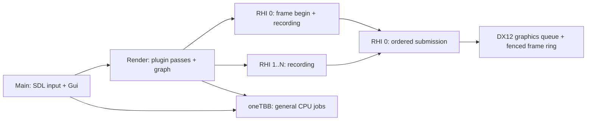
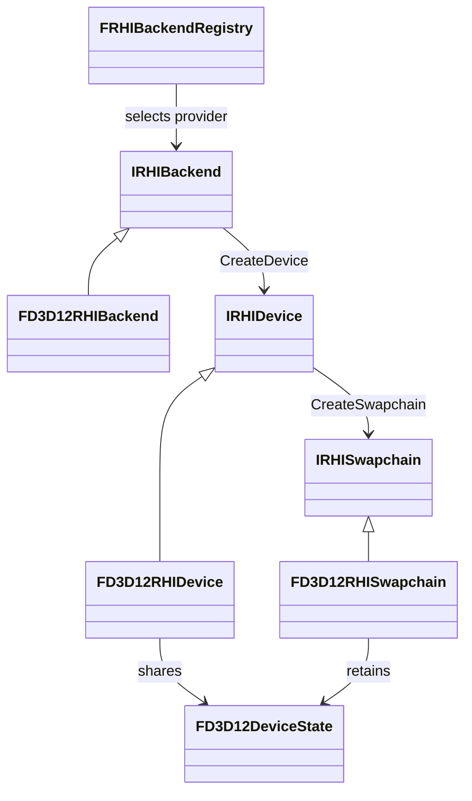

# Architecture and extension contracts

## Frame ownership

Main waits for CPU frame completion before editing the next settings snapshot. GUI data is deep-copied before it reaches Render/RHI. This first version does not overlap Main and Render frames. GPU resource lifetime uses a separate two-frame fence ring; CPU frame completion does not imply GPU completion.

RHI frame control/resource creation belongs to RHI 0. Recording can happen concurrently in distinct contexts; each context can be used once per frame. Submitted draw packets keep their buffers, textures and pipelines alive until the associated fence completes. Resize and shutdown drain the graphics queue. Geometry uses immutable upload buffers, and the font uses a default-heap texture with staging upload.

Task handles carry completion and exceptions. Dependencies are continuation driven and do not occupy waiting workers. Worker waits use oneTBB resumable tasks; a waiting worker can run a child even with one worker configured. Main waits pump Main jobs. Waiting for unfinished work on the same dedicated Render/RHI queue is rejected. Cross-domain cyclic waits are a caller error, not an automatically solved dependency graph. Stop task producers before shutdown. Tracy scopes must not span a resumable worker wait because resumption can migrate between OS threads.

## Adding an experiment

1. Create an `IRenderPlugin` implementation in `Source/Plugins/<Name>` and register its stable ID/factory in the application registry. Declare dependencies on other logical plugins where required.
2. Compile shaders through `FShaderCompiler`, selecting `InDevice.GetCapabilities().ShaderFormat` and using Worker tasks for CPU compilation, and create resources through `IRHIDevice` on RHI 0 in `Start()`.
3. In `Build()`, contribute `FColorPass` commands using owned draw packets. A Load pass depends on previously initialized color contents. The graph inserts transitions and presentation automatically.
4. Release owned handles in `Stop()` after the application drains GPU work. Add the ID to an experiment configuration and restart.

The current graph is explicitly a swapchain color graph. An offscreen GI algorithm will need a future change introducing graph resource handles, textures/formats/usages and read/write tracking across multiple resources. Do not bypass RHI to add native graphics calls in a plugin.

## Reflection, allocation and dependency boundaries

Reflection descriptors expose stable property IDs, kinds, ranges, getters and setters. JSON serialization uses a type ID and schema version. Unknown properties are ignored, missing properties preserve defaults, and incompatible future versions fail. GPU handles are never serialized; persistent assets store identity and source paths.

`Allocate` / `Deallocate` must be paired, with a power-of-two alignment and a `EMemoryTag`. A `FMemoryResource` adapts these hooks to PMR containers. There is no global `new` override; allocator replacement remains local to the core adapter. Third-party allocators are hooked where supported, without claiming full process coverage.

Vendor includes and calls live in each runtime module's `Private/Adapters`, or a native backend's `Private` directory. Public types are owned by Hyperion, and CMake links vendors privately. The include checker catches direct includes; code review must also reject copied vendor aliases or native handles leaking into public contracts. `FNativeSurface` carries the platform's opaque surface token solely for backend initialization.

## Shader contract

Sources use HLSL with column-major matrices and column-vector multiplication. DXC emits shader model 6.0 DXIL or Vulkan 1.1 SPIR-V; SPIRV-Cross supplies resource metadata and MSL source. Space 0 currently maps b-registers directly, t-registers to binding 1000+, s-registers to 2000+, and u-registers to 3000+ to keep Vulkan bindings distinct. Current engine reflection exposes uniform buffers, separate textures and samplers; storage buffers/images and other spaces require extending this contract.

SHA-256 cache keys include a wrapper revision, pinned DXC/SPIRV-Cross identity, entry/stage/format and every file under the configured shader root. Includes must stay inside this root. Source-tree invalidation is deliberately conservative. Cache files carry an integrity digest; corrupt or incomplete files are recompiled. Shader compilation is serialized per compiler instance. MSL output is source generation evidence, not Metal runtime validation.

## GUI contract

The generic `FGui` wrapper owns ImGui/ImPlot contexts on Main. It accepts normalized engine input and exposes controls, reflected property editing, plotting and owned draw data. The initial backend uses a static font atlas; only that texture ID and reset-render-state callbacks are supported. The debug rendering plugin owns its RHI font/pipeline, converts copied vertices/indices to buffers and contributes a color Load pass. Large vertex offsets and framebuffer-scaled scissor rectangles are preserved.

Native windowing, graphics and shader runtime loading currently target Windows/MSVC x64. Cross-platform APIs are extension points, not claims of tested portability.

## Runtime modules and backend selection

See [SourceLayout.md](SourceLayout.md) for module ownership and future Scene/Animation boundaries. Reflection, Math and logical plugin management are independent foundation modules. Application settings do not belong to reflection or asset importing. Runtime modules never include concrete backend or experiment-plugin headers.

The Viewer composition root explicitly registers `RegisterD3D12RHIBackend`, then asks `FRHIBackendRegistry` for a device. `IRHIBackend::CreateDevice` returns a fully initialized `IRHIDevice`; construction failure throws instead of exposing a half-initialized device. Device creation has no window argument. Each `IRHISwapchain` owns its surface, backbuffers, recording contexts and frame progression. The current command API targets one swapchain color buffer; a future offscreen/resource-graph change should introduce command contexts and richer resource descriptions rather than reinterpret the swapchain as a general renderer.

`rhi_backend` is persisted in application settings, defaults to `d3d12` for old configurations, and can be overridden by `--backend`. Recognized but unregistered backends fail before creating a window. There is no implicit fallback or native API selection inside Renderer.

Capabilities contain backend identity, shader target, resource/context limits and separate `Supported`/`Enabled` feature states. The latter means callable through the current engine RHI. D3D12 queries native ray-tracing and mesh-shader support but leaves them disabled because their RHI operations do not exist yet. Required features fail device creation if they cannot be enabled; optional features may remain disabled. Render Graph checks context capacity and readback before beginning a frame, and uses concurrent recording only when enabled. D3D12 currently provides 16 recording contexts, including the final Present transition.

Buffer, texture, pipeline and recorded-list payloads implement engine-owned abstract interfaces, without vendor types. D3D12 validates concrete payload type and device identity before recording native commands. EndFrame also rejects lists from another swapchain, another frame or a duplicate context. Payloads and swapchains retain shared device state (queue, fence, allocator and descriptor storage), so releasing the `IRHIDevice` owner does not invalidate them. Submitted lists retain draw resources until their frame fence completes. Swapchain shutdown/resize drains the shared queue; normal application shutdown drains work, releases plugins, destroys swapchains and then destroys the device. Recorded lists may remain owned by the caller after completion, but must never be submitted again.

Frame begin/end, resource creation, queue operations and destruction are serialized on RHI 0 across all swapchains sharing a device. Only distinct recording contexts may execute concurrently, and all record tasks must complete before frame submission or destruction. Device capabilities are immutable after construction and can be read by shader worker tasks. D3D12's debug layer is process-wide: its first device creation chooses the best-effort policy, and later devices report the actual state rather than attempting to re-enable it while devices exist.
