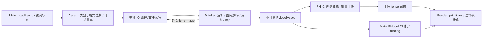

# glTF 资产加载与渲染

当前可以通过引擎的异步资产服务读取静态 glTF 2.0 / GLB，解析场景、图片和材质，再由 D3D12 渲染到窗口。`FModelAsset` 是独立 Scene 模块中的 CPU 数据；原生 `.hasset` 通过反射支持双向持久化。示例资产由仓库脚本原创生成，沿用项目 MIT 许可证，不需要下载模型。

## 运行

从仓库根目录执行：

```powershell
.\tools\GenerateSolution.ps1 -Build -Configuration Debug
.\out\build\vs2022\bin\Debug\hyperion_viewer.exe --config experiments/Model.json

# 加载自己的静态资产，路径有空格时使用引号
.\out\build\vs2022\bin\Debug\hyperion_viewer.exe --model "D:\Models\Scene.glb"

# 无 UI 的截图验收
.\out\build\vs2022\bin\Debug\hyperion_viewer.exe --model assets/Models/Showcase.gltf --frames 180 --hidden --no-ui --capture out/captures/model.png --verify-model
```

Ninja 对应程序路径为 `out/build/debug/bin/hyperion_viewer.exe`。Visual Studio 的调试参数可设为 `--config experiments/Model.json`；项目调试工作目录已经是仓库根目录。

右键拖动旋转，滚轮缩放，方向键调整角度，Home 重新按当前角度取景，Tab 隐藏或显示面板。GUI 捕获鼠标/键盘时，相机相应输入暂停。初始距离来自保守世界包围盒：每个 primitive 计算一次局部 AABB，各实例变换其 8 个角。面板显示 Loading、Uploading、Ready 或加载错误；加载过程中仍绘制背景和 UI。文件路径由 `model_source` 配置字段或 `--model` 指定，非空时使用 `model-viewer` 插件；无模型路径仍运行原有三角形实验。

`--verify-model` 要求指定有限帧数和截图，检查模型已经完成 GPU 上传且画面具有足够的非背景覆盖。它是进程级 smoke test；材质、遮挡和线程正确性另有独立测试。很大的模型可能超过给定帧数，应增加 `--frames`。

## 格式支持范围

| 项目 | 当前行为 |
| --- | --- |
| 文件容器 | `.gltf` JSON、`.glb` 二进制；解析器检查文件内容 |
| 依赖来源 | 外部相对文件、百分号编码的 UTF-8 路径、base64 data URI、GLB BIN 和 image bufferView |
| 网格 | 多 mesh / primitive，索引或非索引 triangle list、strip、fan；统一转为三角形 |
| Accessor | offset、stride、interleaved、normalized、sparse；8/16/32 位无符号索引 |
| 属性 | POSITION、NORMAL、TANGENT、COLOR_0、TEXCOORD_0/1；缺少法线生成平面法线，缺少切线根据法线贴图 UV 生成 |
| 节点 | TRS 或 matrix、父子层级、多节点共享网格；优先 default scene，否则首个 scene；没有 scenes 时使用顶层节点 |
| 图片 | PNG、JPEG，从引擎读取的内存解码；生成完整 CPU mip 链 |
| 材质 | metallic-roughness 的 base color、metallic/roughness、normal、occlusion、emissive；因子、UV 选择和 sampler |
| 颜色 | base color / emissive 作为 sRGB，数据纹理作为线性；sRGB mip 在线性空间平均；输出通过 sRGB RTV 编码 |
| 光照 | GGX 直接方向光、少量环境项、Reinhard 色调映射；支持 `KHR_materials_unlit` |
| Alpha / 面向 | Opaque、Mask、Blend；透明 primitive 按中心的投影深度从后向前排序并关闭深度写入；双面、镜像节点绕序、逆转置法线矩阵 |
| 原生持久化 | `.hasset` 通过同一资产服务反射读写；glTF/GLB 导出明确报错 |

本阶段不包含动画、骨骼蒙皮、morph target，遇到这些数据会拒绝导入。points/lines、UV2 及更高 UV 集不支持。唯一支持的 glTF 扩展是 `KHR_materials_unlit`；其他 **required** 扩展报错，其他 **optional** 扩展被忽略并记录在 `FModelAsset::Diagnostics`，基础 fallback 数据仍需符合上述范围。没有 Draco、meshopt、BasisU/KTX2、`KHR_texture_transform` 或扩展材质解码。

这不是完整的 glTF 一致性实现：没有 IBL、阴影、动画或 glTF camera 导入；缺失切线的生成不是 MikkTSpace；透明排序以 primitive 中心为粒度，不能解决相交透明面。FBX、OBJ、COLLADA 尚未接入。硬件验证针对 Windows x64、D3D12、RTX 5080；目前最多 256 个采样纹理描述符，由同一设备上的模型和 GUI 共享。

## IO、反射与线程分工



`Runtime/IO` 定义 `IFileSystem`、`FLocalFileSystem`、`FMemoryFileSystem` 与 `FIOService`。替换存储后端时只需注入 `IFileSystem`。实际文件操作在 `EDomain::Io` 的单个专用线程执行；初版使用阻塞系统文件操作，但相对于调用者是异步的。写入使用同目录唯一临时文件，然后原子替换目标。

`Runtime/AssetImport/Private/Adapters/GltfImport.cpp` 封装已锁定的 cgltf v1.15。根文件、外部 buffer 和图片均由引擎读入；cgltf 只解析内存，它的文件回调被显式拒绝，stb 只从内存解码。第三方类型不会进入公共引擎接口。解析期间保存 GLB 根字节和外部 buffer 所有权，直到解析结束。

调用 cgltf 验证器前，适配器先检查所有 bufferView 的物理范围、accessor/sparse 布局以及节点真实路径深度。基础交错属性与紧密排列的 sparse overlay 分别读取，支持两者组合。节点层级最多 256 层，与节点在文件中的排列顺序无关。

Worker 请求依赖字节时通过现有 oneTBB resumable wait 挂起，因此一个 Worker 也能继续执行其他任务。IO 线程只做存储操作，不做模型转换、图片解码或反射遍历。调用者不在帧循环中等待模型请求，只轮询 `Ready()` / `GetReady()`。

GPU 资源创建在 RHI 0 执行；一次模型图片上传使用一个批次和 fence，暂存资源保留到 fence 完成，不逐张纹理 `WaitIdle()`。模型仅在上传完成后提交绘制。帧内缓冲区与纹理由 draw packet 保留到帧 fence 完成。当前仍是单 graphics queue；顶点/索引采用不可变 upload heap buffer，尚无专用 copy queue。PSO 创建仍可能产生 CPU 帧抖动，异步 IO 不代表所有操作都没有开销。

整个场景按帧批量创建常量 buffer，各 draw 使用独立的 512 字节片；后端检查偏移对齐与范围。buffer 不跨帧写入复用，沿用已有 fence 生命周期。已有 normals 和 tangents 的网格跳过方向生成。

启动配置读取、日志、shader source/cache 和保留的同步兼容函数尚未迁移到 IO 服务。新的模型加载、原生资产保存、Viewer 截图编码/写入和配置保存使用异步路径。截图 PNG 编码在 Worker，字节写入在 IO；退出前等待保存完成。

模型及程序化三角形统一使用 [RenderPrimitives.md](RenderPrimitives.md) 的 session/primitive 流程。`FModel` 是 Main 逻辑组，多个实例共享同一资产资源服务的 VB/IB、材质与纹理。相机在 Main 生成自有 view，Render 做全场景深度/透明组织；proxy 与 GPU 资源分别在 Render 和 RHI 0 析构。

## 调用和扩展

```cpp
FTaskSystem Tasks(3, 2);
FIOService IO(Tasks);
FAssetService Assets(IO);
RegisterGltfImporter(Assets);
auto Request = Assets.LoadAsync<FModelAsset>("assets/Models/Showcase.glb");

// 在后续帧轮询；CPU 就绪和 GPU 就绪是不同阶段。
if (Request.Ready())
{
	auto Model = Request.GetReady(); // 成功返回 shared_ptr<const FModelAsset>；失败抛出保留的异常。
	auto Save = Assets.SaveAsync("out/model.hasset", Model);
}

// 停止插件/请求生产者后，先 Drain，再关闭 IO 所依赖的 TaskSystem。
Assets.Drain();
Tasks.Shutdown();
```

调用方应保留保存请求以观察错误。`Get(Tasks)` 是显式等待入口，适合工具流程或 Worker，不应放在 Viewer 的 Main/Render 帧循环中。`Drain()` 关闭服务的请求入口并收尾；已有请求保留成功或失败结果，`Drain()` 本身不重新抛出每项任务的错误。服务析构会先请求取消再收尾。

同一规范化绝对路径和记录类型共享 CPU 加载结果；路径目前仅作 lexical normalization，不消除符号链接或 Windows 大小写别名。单个消费者的 `Cancel()` 不影响其他消费者；底层共享加载仍可完成并进入缓存。已经等待中的 `Get()` 会在生产者完成后检查取消，轮询消费者可立即观察取消。缓存当前由服务强持有，可用 `ClearCache()` 显式释放；没有 LRU、热重载或自动文件变化监控。原生保存成功后清除对应路径/类型的旧缓存。

加载失败后，已有请求保留原错误；同一路径/类型的下一次 `LoadAsync()` 会重新读取并尝试导入，不需要清空整个缓存。重试中的请求继续共享同一个生产者，其他已成功加载的资产继续复用缓存。

glTF 私有适配器按访问器/URI 读取、材质、图元转换和场景组装拆分。一次导入会话持有 cgltf 文档及全部外部 buffer，保持范围校验、节点层级校验、图片解码和模型验证的顺序；公开资产接口与支持的 glTF 范围保持不变。

取消是协作式的：已进入 OS 的读写可能完成，取消不能撤销已经替换的文件。读取默认限额 512 MiB，导入另有限制聚合 buffer/解码结果的预算和单属性数量；PNG/JPEG 单张解码上限为 256 MiB、单边最多 16384。它们不是整个进程峰值内存的硬配额。Archive 也限制 512 MiB、64 层节点和读取时的容器/节点数量。

`FRecordDescriptor` 使用稳定类型 ID、版本、工厂和 `Member("fieldId", &Type::Field)` 注册字段，支持标量、枚举、字符串、嵌套记录、vector、固定 array 与数值 bulk。`.hasset` 携带 `HYPA` magic、版本、字段 ID 和 bulk 元素类型；数值使用 little endian，不保存 C++ 结构体布局、指针或 GPU 句柄。缺失字段保持默认值，未知字段跳过，未来版本和类型错误拒绝。新对象完成全部字段绑定及可选类型验证后才发布；模型验证包含索引、属性、材质引用和节点层级。现有配置/GUI 的 `FTypeDescriptor` 保留，JSON 序列化新增内存接口，没有改写旧配置键。

glTF 的 accessor、材质语义和节点引用不能仅凭同名字段反射为引擎对象。每种外部格式仍需一个集中适配器完成语义转换；业务层统一调用资产服务。引擎原生资产新增字段时只注册字段，通用 Archive 完成读写绑定，不需要每个字段重复 open/read/assignment。当前没有反射代码生成、任意指针对象图、schema 迁移回调或通用编辑器。

未来接入 FBX/OBJ/COLLADA 时，可在 `AssetImport/Private/Adapters` 增加 Assimp importer，注册 `FAssetCodec` 的类型 ID、扩展名和 Load 回调，并将 Assimp `IOSystem`/`IOStream` 接到同一个 IO 服务。专用格式解析库可以并存，模型桥接始终消费 `FModelAsset`，而通用 Renderer 只通过 render primitive 收集场景绘制。同步库的 IO handler 需要在 Worker 中请求 IO 并挂起等待，或先预取依赖；不能将整个 importer 放进 IO 线程。不得跨 resumable wait 持有 OS 线程绑定的锁或 Tracy scope。未来第三方 exporter 是单独的能力扩展；当前只有内置 `.hasset` writer。

## OpenSpec 顺序与验证

| 顺序 | 变更 | 交付 |
| --- | --- | --- |
| 1 | [add-async-asset-io](../openspec/changes/archive/2026-09-06-add-async-asset-io/proposal.md) | IO 域、字节 IO、取消与原子写 |
| 2 | [add-reflected-object-archives](../openspec/changes/archive/2026-09-06-add-reflected-object-archives/proposal.md) | 递归反射记录、内存 Archive |
| 3 | [add-static-model-data](../openspec/changes/archive/2026-09-06-add-static-model-data/proposal.md) | 独立 Scene 模型、变换与校验 |
| 4 | [add-async-gltf-import](../openspec/changes/archive/2026-09-06-add-async-gltf-import/proposal.md) | 统一资产服务、cgltf adapter、原生持久化 |
| 5 | [add-static-model-rendering](../openspec/changes/archive/2026-09-06-add-static-model-rendering/proposal.md) | 深度、材质、上传、ModelViewer |
| 6 | [validate-gltf-asset-pipeline](../openspec/changes/archive/2026-09-06-validate-gltf-asset-pipeline/proposal.md) | 自动化回归、截图与文档 |

六个变更已于 2026-09-06 归档，规格已同步到 `openspec/specs`。每个归档目录内保留 `verification.md`，记录对应测试及完整套件结果。

本轮独立审计与最小修复的核实过程、回归和最终验证日志见 [ModelViewerReview.md](ModelViewerReview.md)。

2026-09-06 首次交付验证：Visual Studio 2022 的 Debug / Release 均通过 **23/23** CTest 测试，GPU debug layer 为 **0 个错误**；日志为 `out/GltfVsDebugVerified.log` 和 `out/GltfVsReleaseVerified.log`。同日独立审计修复后再次通过 Debug / Release **23/23**，最新日志为 `out/ModelReviewDebug.log` 和 `out/ModelReviewRelease.log`。Ninja 编译和语义命名检查另行验证。构建只剩未修改的 TinyEXR 上游警告，不修改依赖源码。

```powershell
python tools/GenerateModelFixtures.py --output out/fixtures
.\tools\GenerateSolution.ps1 -Test -Configuration Debug
.\tools\GenerateSolution.ps1 -Test -Configuration Release
python tools/CheckStyle.py
python tools/CheckBoundaries.py
.\tools\Build.ps1
python tools/CheckStyle.py --naming --build-dir out/build/debug
openspec validate --all --strict
```

CTest 自动生成离线 fixtures。`async_gltf_import` 覆盖多容器、稀疏/交错/归一化属性、拓扑展开、引用错误、请求共享、取消、服务析构和原生 round-trip；`model_rendering` 对已知像素验证深度、线性 alpha 混合、mask、UV1/sRGB/mip、绕序，并在物理读取被门控阻塞期间绘制/缩放帧，然后验证相机输入和加载错误。`model_viewer_acceptance` 启动真实 Viewer 验证 glTF、GLB、UI、截图与缺少依赖的退出结果。

图像证据写入 `out/captures/model-viewer-Showcase.gltf.png`、`model-viewer-Showcase.glb.png`、`model-alpha.png`、`model-mask.png` 和 `model-orbit.png`。GPU 回归比较容许误差的像素区域；这些测试验证当前支持范围，不能替代全套 glTF conformance 测试。
