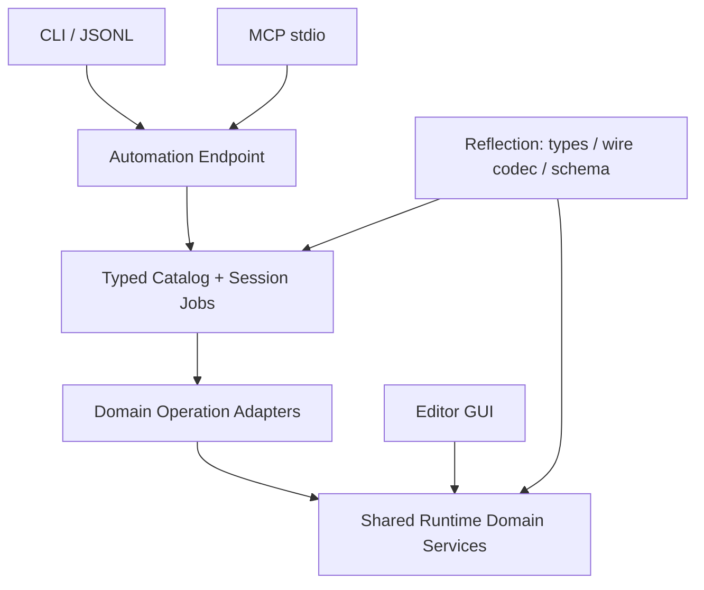

# 引擎自动化接口

Hyperion 提供共享的操作目录、严格 JSON 数据契约和会话任务执行器，通过 CLI、JSON-lines 和 MCP stdio 暴露。设计优先级是长期可维护性、GUI/agent 业务逻辑一致性，再逐步增加覆盖。目录是正式接口的事实来源；测试通过正式接口验证功能，不充当隐藏的调用协议。

## 使用

在仓库根目录构建，无需启动窗口或创建设备：

```powershell
.\tools\Build.ps1 -Preset debug -Target hyperion_automation_cli
& .\out\build\debug\bin\hyperion_automation_cli.exe --help
& .\out\build\debug\bin\hyperion_automation_cli.exe engine.info
& .\out\build\debug\bin\hyperion_automation_cli.exe api.search --json '{"query":"texture encoding"}'
& .\out\build\debug\bin\hyperion_automation_cli.exe api.describe --json '{"operation":"texture.set_encoding"}'
& .\out\build\debug\bin\hyperion_automation_cli.exe types.describe --json '{"type":"hyperion.textureasset"}'
```

使用 PowerShell 7 的标准原生命令参数传递。也可以用 `--json-file Parameters.json` 避免 shell 引号问题。启动不读取挂载配置文件或 Editor 偏好；`/Engine` 默认使用开发构建的仓库 `Content`，可用 `--engine-content <directory>` 覆盖。`/Game` 默认未设置，agent 可查询并设置 root。单次调用可传 `--asset-root <directory>`，其内部调用同一个服务；`--read-only` 将 Game 设为只读。路径规则和原生资产格式见 [ContentFileSystem.md](ContentFileSystem.md)。

一次命令启动一个会话，异步调用会等待结果后退出。需要保留文档、撤销历史或任务 ID 的工作流使用持久进程：

```powershell
& .\out\build\debug\bin\hyperion_automation_cli.exe --stdio
```

`--stdio` / `--mcp` 要求 stdin 是管道或重定向文件，由客户端写入和读取；不会占用阻塞的 stdin 工作线程。每行一条 UTF-8 JSON 请求，stdout 只输出协议 JSON，日志和启动错误进入 stderr。

JSONL 示例，`id` 可省略，也可以是字符串或整数：

先查询并设置 root。`generation` 使用查询响应中的值；首次未设置时为 `"0"`。`directory` 是服务器进程可访问的本地目录，建议使用绝对路径。

```json
{"id":"root-info","method":"api.call","params":{"operation":"content.root.get","arguments":{}}}
{"id":"root-set","method":"api.call","params":{"operation":"content.root.set","arguments":{"directory":"F:/HyperionAssets","generation":"0"}}}
```

设根成功后，再执行资产操作：

```json
{"id":"1","method":"api.search","params":{"query":"asset"}}
{"id":"2","method":"api.describe","params":{"operation":"asset.open"}}
{"id":"3","method":"api.call","params":{"operation":"asset.open","arguments":{"path":"/Game/Textures/Example.hasset"}}}
```

响应为 `{"id":"3","result":...}`。资产打开通常得到：

```json
{"status":"running","job":"<session>/job/1","operation":"asset.open","cancellable":false,"pollAfterMs":20}
```

调用 `jobs.get` 并传入该 `job`，直到状态不再是 `running`；成功结果位于 `outcome.result`。其中的 `document`、`generation` 用于后续操作：

```json
{"id":"4","method":"jobs.get","params":{"job":"<returned job>"}}
{"id":"5","method":"api.call","params":{"operation":"asset.rename","arguments":{"document":"<returned document>","generation":"1","name":"New name"}}}
{"id":"6","method":"api.call","params":{"operation":"asset.save","arguments":{"document":"<returned document>","generation":"2"}}}
```

占位符和 generation 必须替换为当前响应值。改名、撤销、重做或纹理修改后重新使用返回的 generation；`asset.info` 可刷新状态。保存捕获提交时的草稿，在保存期间继续编辑会保留 dirty。关闭脏文档需要先保存或显式 `discard:true`。

MCP 客户端配置的 `command` 指向构建出的 `hyperion_automation_cli.exe`，`args` 使用 `["--mcp"]` 即可。当前明确实现 **2025-11-25** 协议的 initialize、initialized 通知、ping、tools/list 和 tools/call stdio 子集；不声明 Resources、Prompts、MCP Tasks 或 HTTP 能力。初始化返回版本供客户端协商。引擎异步任务通过普通工具查询，不要求客户端支持 MCP Tasks。参考官方 [生命周期](https://modelcontextprotocol.io/specification/2025-11-25/basic/lifecycle)、[工具](https://modelcontextprotocol.io/specification/2025-11-25/server/tools)和 [stdio 传输](https://modelcontextprotocol.io/specification/2025-11-25/basic/transports)。

`content.root.get/set/clear` 返回 directory、generation 和 readOnly。设根和清空需要当前 root generation，区别于资产 document generation。切换会关闭旧文档并使旧句柄失效；同一目录与权限不会关闭文档。未保存文档需先调用 save 或显式传 `discard:true`；busy 时先等待编辑/保存结束。不存在的目录及 stale/dirty/busy 请求保留当前内容。清空后 `/Engine` 仍可用。Root 属于当前进程，不会自动传到下一次单次 CLI 调用，也不修改另一个 Editor 进程的偏好。大目录设根目前同步完成扫描后返回。

## 按需发现

MCP 只声明固定的少量入口。搜索不会改写 `tools/list`，新领域操作不增加启动时的工具声明量。

| 入口 | 用途 |
|---|---|
| `engine.info` | 会话和执行契约 |
| `api.search` | ID、摘要、可用状态；query 按词匹配 ID、摘要、owner 和关键词；offset/limit 分页 |
| `api.describe` | 完整 input/output JSON Schema、版本、例子、副作用、完成语义、执行域 |
| `types.describe` | 按稳定类型 ID 查询已注册类型，无需加载资产 |
| `api.call` | 按 operation ID 和 arguments 调用；服务端始终执行完整验证 |
| `jobs.get` / `jobs.cancel` | 查询或取消本会话的任务 |

这是声明的按需展开，不是插件热加载。插件在启动时选择，注册完成后目录封闭；不可用的 provider 可以留下带原因的声明。`--disable-plugin assets` 保留资产操作的查询能力，但调用返回 `unavailable`；`--disable-plugin automation-assets` 移除该适配器的声明。资产启动失败同样不会让无关查询分支退出。传输或会话自身不可用时以非零退出码失败，详情在 stderr。

## 分层与所有权



- `Runtime/Reflection`：保留原持久化契约，增加自然 JSON 投影与 JSON Schema。`Description` 是消费方无关的字段说明，已有 Inspector tooltip 可作回退。Inspector 只读/范围提示不等价于业务校验或自动化授权。
- `Runtime/Automation`：操作目录、类型化绑定、错误、任务、固定入口及 MCP 协议适配。不依赖 GUI、资产领域、Renderer 或 RHI。
- `Runtime/Content`：共享 root 状态、反射请求/结果、候选索引和内容消费者切换契约；不依赖图形或插件。
- `Runtime/AssetEditing`：`FAssetEditDocument` 的草稿、历史、generation、保存状态和纹理重建。Editor 与自动化适配器共享这一实现。它与 `Assets/NativeAsset.h` 中保存文件解码结果的 `FAssetDocument` 是不同概念。
- `Plugins/Automation`：注册资产适配器，持有会话文档和后台任务；stdio 适配器持有输入缓冲。原生管道 API 限于 `Private/Adapters`。
- `Applications/Automation`：解析启动参数、选择插件和资产提供方。通用 Application 宿主仍只负责 Tasks、Main pump、时间和退出。

`automation-catalog` 提供目录；适配器依赖该插件并声明 `Before={"automation-session"}`。`automation-session` 封闭目录、提供会话和 endpoint；`automation-stdio` 依赖会话。**服务 Requires 描述服务需求，Dependencies 才负责选择必需插件**。可选资产服务只影响资产分支。

所有操作调用、任务 Poll/Cancel、文档提交在 Main。工作线程只能处理拥有自身数据的快照，通过完成结果回到 Main。停机顺序为：关闭入口 → 会话停止接收 → Main pump/Poll 到已接收任务结束 → provider 排空自己的工作 → 释放文档、IO、Tasks。provider 不得关闭别的插件拥有的共享资产服务。

## 新功能接入契约

新增人类可操作功能时，先确定 UI 无关的领域服务。GUI 的按钮/Inspector 与自动化适配器调用同一服务，校验、事务、历史、保存和资源准备只能有一份业务实现。已有功能若仍只在 Editor Private，应先抽取必要服务，不要复制 GUI 分支到 MCP/CLI，也不要从自动化调用鼠标事件。

每项操作只需要以下扩展工作：

1. 定义请求和结果值类型，通过 `MakeRecord` / `Member` 注册。必填字段设置 `bRequired`，字段语义写 `Description`；业务不变量放类型 validator 或共享领域服务。
2. 用 `MakeOperation<TRequest,TResult>` 或 `MakeAsyncOperation<TRequest,TResult>` 注册稳定 ID、summary、description、owner、effects、completion 和一个合法 example。异步处理器返回 `TPendingOperation<TResult>`，包含 Main 上的 Poll，只有实际支持取消时才提供 Cancel。
3. 在功能插件 Start 中，先用 `FPluginContext::Defer` 登记 `Catalog.UnregisterOwner(<unique owner>)` 清理，再向目录注册；owner 使用该 provider 独占的稳定标识，通常为插件 ID。启动中途失败时也会撤回可调用闭包，纯类型元数据可以保留。绑定只调用共享服务。插件须在会话之前启动、之后释放；工作一旦提交就必须拥有可排空的记录。`UnregisterOwner` 仅用于启动回滚/停机清理，不提供运行时插件卸载。
4. 验证 discovery → describe → call、非法参数无副作用、GUI 等价行为和所需生命周期。新增请求字段只改反射记录；CLI/MCP 不应同步新增序列化分支。
5. 尚不适合对外的功能在下方覆盖表说明具体缺失的契约，后续按领域接入。不能把“有 Public 头文件”或“测试能调用”当成已支持。

最小同步绑定形态如下；请求/结果的 `RecordType` 应与领域 API 一起定义：

```cpp
FOperationInfo Info;
Info.Id = "document.rename";
Info.Summary = "Rename document";
Info.Description = "Change the display name of the current document revision.";
Info.Owner = "document-editing";
Info.Effects = "Changes draft and history; call save to persist.";
Info.Completion = "Draft committed on Main.";
const FRenameRequest Example{/* valid example request */};
Info.Example = WriteRecordWire(RecordType<FRenameRequest>(), &Example);
Catalog.Register(MakeOperation<FRenameRequest, FDocumentInfo>(
    std::move(Info),
    [&Documents](const FRenameRequest& InRequest)
    {
        return Documents.Rename(InRequest);
    }));
```

请求引用不能被 pending lambda 借用；应捕获复制的数据或由 provider 拥有的对象。例子会在注册时验证。请求/结果描述符须具有静态或覆盖目录的生命周期。目录拒绝重复 ID、运行期间注册和非所属线程访问。反射并不自动推断方法副作用、执行域、资源寿命和完成语义，这些由操作注册显式表达。

类型 ID、operation ID、字段键及错误 code 是对外契约。兼容扩展可以添加带默认值的可选输入字段；新增必填字段、改类型或改变语义需明确版本策略，通常注册新 ID 并保留旧适配器。`Version` 是可查询的契约标识，不是自动迁移器。不要用资产持久化迁移偷偷改变操作输入语义。

## 值、结果与限制

请求采用自然对象，不要求客户端理解内部 `{type,version,fields}` envelope 或 bulk。支持嵌套记录、optional/null、字符串键 map、序列、固定数组、合法枚举和数值范围。拒绝未知字段、持久化 alias、缺失必填字段、非法 enum、越界及重复 JSON 键。API DTO 使用 `bPersistent=true` 字段；不应把 API 专属可见性绑定到 GUI 展示策略。

64 位有符号/无符号整数使用规范十进制**字符串**，例如 `"18446744073709551615"`，避免 JavaScript 精度损失；32 位及更小整数使用 JSON number，整数值的 `1.0` 也被接受。schema 的 format/pattern 表达宽整数，精确范围由 codec 验证。没有显式枚举集合的枚举只有其底层整数约束。业务 validator 可能施加无法自动翻译为 JSON Schema 的约束，须在操作/字段说明中写清。

`RecordWireSchema` 是传输投影，不承诺资产文件的字节布局。schema 当前内联嵌套类型；循环/超深值类型需要有界 DTO 或稳定引用 ID。大型纹理、模型和 GPU 数据应通过受控 artifact/资源引用协议接入；不要将 bulk 或原生指针塞进工具结果。

同步操作成功返回 `{"status":"completed","result":{...}}`；失败返回 `{"status":"failed","error":{"code":"...","message":"...","path":"...","details":{...}}}`。异步任务有 `running/completed/failed/cancelled` 状态，终态的 `outcome` 使用同样结果封装。请求合法但操作失败在 MCP 中使用工具 `isError`；协议错误使用 JSON-RPC error。JSONL 的单次无效请求会得到错误并允许后续请求，过大的输入行或断开的输出流会终止进程并排空工作。

常见错误包括 `invalid_arguments`、`not_found`、`unavailable`、`busy`、`stale_revision`、`read_only`、`dirty_document`、`save_failed`、`not_cancellable`、`session_closed`、`root_unset`、`invalid_root`、`content_failed`。`result_unavailable` 表示处理器已经运行，但结果无法在领域结果预算内编码；操作可能已完成，客户端须核对当前状态，不能把它当作参数被拒绝。错误不意味着自动回滚已经完成的外部副作用，客户端不得自动重试非幂等调用。

默认边界：输入 JSON 消息和未包装的领域结果各自最多 1 MiB、65,536 节点、48 层；反射类型投影最多 32 层；搜索默认 12 项，最多 50 项，query 最多 256 字节；会话最多 32 个运行任务，保留最多 128 个任务（满时淘汰最早的已结束任务）；资产适配器最多 64 个打开文档。传输响应另有 **4 MiB + 64 KiB、65,792 节点、56 层**的上限，为 MCP text/structuredContent 双份结果、JSON 转义、原样回传请求 ID 及任务/状态封装留出空间；领域应继续分页、摘要化或返回资源引用。响应编码失败使用结果不可用或内部错误，不作为非法参数；JSONL 会保留请求 ID 并继续接收后续请求。

job/document ID 属于当前进程会话，关闭或重启后无效；它们不是稳定资产 ID，也不是安全认证凭据。当前连接仅为本地 stdio，无网络监听。EOF 等待已接收任务完成，不隐式保存脏草稿。取消只用于声明支持取消的操作，不表示撤销；首批资产异步操作在接收后不支持取消。强杀进程不属于正常排空路径。

## 能力覆盖与后续适配

具体操作名称和完整 schema 始终从运行时目录查询。本表记录领域状态，避免维护另一套全量接口清单。

| 领域 | 当前支持 | 后续接入基础 |
|---|---|---|
| 发现与执行 | 所有已注册操作的搜索、描述、严格调用、任务与错误；CLI/JSONL/MCP 共用 | 分页资源/artifact、批处理等按需求扩展 |
| 非场景原生资产文档 | 模型/材质/纹理/天空的打开、元信息、改名、undo/redo、save/close；稳定 identity 与磁盘冲突检测 | 更多属性应复用领域 setter，不能绕过校验直接 patch 所有字段 |
| 纹理 | 2D RGBA8 的编码变更和 mip 重建，与 GUI 共用算法/历史 | 浮点、cube、导入重建等操作按语义定义 |
| 模型/材质/天空 | 可查询类型 schema；上述文档操作 | 引用编辑、材质参数、模型节点、天空重建需要逐项共享领域服务 |
| 场景编辑 | 尚未注册 | 抽取场景文档/选择/事务服务，保留 Main 权威与稳定对象身份 |
| 渲染、截图、抓帧 | 尚未注册 | 显式 view、GPU ready/fence、artifact、取消与生命周期契约 |
| 内容根切换 | 查询、设置、清空 Game root，与 GUI 共享 generation、dirty/busy 校验及参与者退休 | 大目录异步扫描、活跃 Editor 附着按需扩展 |
| 导入、发布 | 现有 AssetTool 能力保留，尚未接入目录 | 共享导入任务/发布事务，不调用测试入口 |
| 活跃 Editor 附着 | 尚未实现；当前自动化进程拥有独立草稿 | 加传输并连接同一服务实例，解决多客户端 revision/事件和冲突 |
| 底层 Public C++ API | 不自动导出指针、回调、RHI 对象或测试辅助接口 | 以可序列化的领域操作、句柄和资源协议表达等价能力 |

目标是持续扩大人类任务的等价能力，不是一比一 RPC 每个 C++ 方法。自动化与 GUI 当前共享逻辑，但独立进程不共享内存草稿；同一资产文件通过保存时的 digest/identity 检查防止覆盖外部修改。

## 验证入口

`automation_contracts` 覆盖 wire/schema、注册扩展、校验、任务和 MCP 生命周期；`automation_assets` 覆盖共享文档等价行为、保存期间编辑、冲突和插件排空；`automation_transport` 启动真实 CLI/MCP 进程并创建隔离的原生资产验证持久化、只读挂载、缺失/失败/禁用提供方和 EOF。`editor_asset_documents`、`editor_asset_workspace` 及 Editor 资产验收保护 GUI 消费方。

```powershell
.\tools\Build.ps1 -Preset debug -Target automation_tests
.\tools\Build.ps1 -Preset debug -Target automation_asset_tests
.\tools\Build.ps1 -Preset debug -Target hyperion_automation_cli
ctest --test-dir out/build/debug -R '^automation_' --output-on-failure
```

完整构建、样式和其他回归入口见 [CodingStyle.md](CodingStyle.md)、[Verification.md](Verification.md)。
