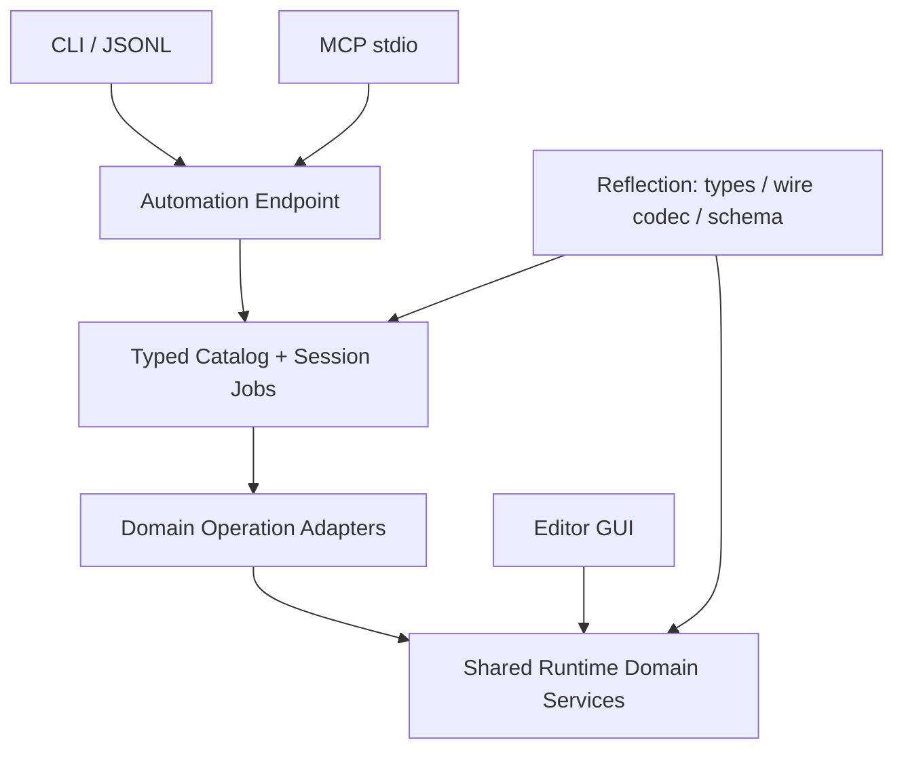

# 引擎自动化接口

Hyperion 提供共享的操作目录、严格 JSON 数据契约和会话任务执行器，通过 CLI、JSON-lines 和 MCP stdio 暴露。设计优先级是长期可维护性、GUI/agent 业务逻辑一致性，再逐步增加覆盖。目录是正式接口的事实来源；测试通过正式接口验证功能，不充当隐藏的调用协议。

## 使用

独立模式无需启动窗口或创建设备。附着到正在运行的 Editor 见 [连接与 live scene 操作](AutomationConnections.md)。在仓库根目录构建：

```powershell
.\tools\Build.ps1 -Preset debug -Target hyperion_automation_cli
& .\out\build\debug\bin\hyperion_automation_cli.exe --help
& .\out\build\debug\bin\hyperion_automation_cli.exe engine.info
& .\out\build\debug\bin\hyperion_automation_cli.exe api.search --json '{"query":"texture encoding"}'
& .\out\build\debug\bin\hyperion_automation_cli.exe api.describe --json '{"operation":"texture.set_encoding"}'
& .\out\build\debug\bin\hyperion_automation_cli.exe types.describe --json '{"type":"hyperion.textureasset"}'
```

使用 PowerShell 7 的标准原生命令参数传递。也可以用 `--json-file Parameters.json` 避免 shell 引号问题。启动不读取挂载配置文件或 Editor 偏好；`/Engine` 默认使用开发构建的仓库 `Content`，可用 `--engine-content <directory>` 覆盖。`/Game` 默认未设置，agent 可查询并设置 root。单次调用可传 `--asset-root <directory>`，其内部调用同一个服务；`--read-only` 将 Game 设为只读。路径规则和原生资产格式见 [ContentFileSystem.md](ContentFileSystem.md)。

一次命令启动一个会话，异步调用会等待结果后退出。需要保留文档、撤销历史或任务 ID 的工作流使用持久进程：

```powershell
& .\out\build\debug\bin\hyperion_automation_cli.exe --stdio
```

`--stdio` / `--mcp` 要求 stdin 是管道或重定向文件，由客户端写入和读取；不会占用阻塞的 stdin 工作线程。每行一条 UTF-8 JSON 请求，stdout 只输出协议 JSON，日志和启动错误进入 stderr。

JSONL 示例，`id` 可省略，也可以是字符串或整数：

先查询并设置 root。`generation` 使用查询响应中的值；首次未设置时为 `"0"`。`directory` 是服务器进程可访问的本地目录，建议使用绝对路径。

```json
{"id":"root-info","method":"api.call","params":{"operation":"content.root.get","arguments":{}}}
{"id":"root-set","method":"api.call","params":{"operation":"content.root.set","arguments":{"directory":"F:/HyperionAssets","generation":"0"}}}
```

设根成功后，再执行资产操作：

```json
{"id":"1","method":"api.search","params":{"query":"asset"}}
{"id":"2","method":"api.describe","params":{"operation":"asset.open"}}
{"id":"3","method":"api.call","params":{"operation":"asset.open","arguments":{"path":"/Game/Textures/Example.hasset"}}}
```

响应为 `{"id":"3","result":...}`。资产打开通常得到：

```json
{"status":"running","job":"<session>/job/1","operation":"asset.open","cancellable":false,"pollAfterMs":20}
```

调用 `jobs.get` 并传入该 `job`，直到状态不再是 `running`；成功结果位于 `outcome.result`。其中的 `document`、`generation` 用于后续操作：

```json
{"id":"4","method":"jobs.get","params":{"job":"<returned job>"}}
{"id":"5","method":"api.call","params":{"operation":"asset.rename","arguments":{"document":"<returned document>","generation":"1","name":"New name"}}}
{"id":"6","method":"api.call","params":{"operation":"asset.save","arguments":{"document":"<returned document>","generation":"2"}}}
```

占位符和 generation 必须替换为当前响应值。改名、撤销、重做或纹理修改后重新使用返回的 generation；`asset.info` 可刷新状态。保存捕获提交时的草稿，在保存期间继续编辑会保留 dirty。关闭脏文档需要先保存或显式 `discard:true`。

MCP 客户端配置的 `command` 指向构建出的 `hyperion_automation_cli.exe`，`args` 使用 `["--mcp"]` 即可。当前明确实现 **2025-11-25** 协议的 initialize、initialized 通知、ping、tools/list 和 tools/call stdio 子集；不声明 Resources、Prompts、MCP Tasks 或 HTTP 能力。初始化返回版本供客户端协商。引擎异步任务通过普通工具查询，不要求客户端支持 MCP Tasks。参考官方 [生命周期](https://modelcontextprotocol.io/specification/2025-11-25/basic/lifecycle)、[工具](https://modelcontextprotocol.io/specification/2025-11-25/server/tools)和 [stdio 传输](https://modelcontextprotocol.io/specification/2025-11-25/basic/transports)。

`content.root.get/set/clear` 返回 directory、generation 和 readOnly。设根和清空需要当前 root generation，区别于资产 document generation。切换会关闭旧文档并使旧句柄失效；同一目录与权限不会关闭文档。未保存文档需先调用 save 或显式传 `discard:true`；busy 时先等待编辑/保存结束。不存在的目录及 stale/dirty/busy 请求保留当前内容。清空后 `/Engine` 仍可用。Root 属于请求实际路由的进程，不会自动传到下一次独立 CLI 调用。附着 Editor 的 root 操作更新目标偏好，与 GUI 相同。大目录设根目前同步完成扫描后返回。

## 按需发现

MCP 只声明固定的少量入口。搜索不会改写 `tools/list`，新领域操作不增加启动时的工具声明量。

| 入口 | 用途 |
|---|---|
| `targets.list/probe/connect/disconnect` | 发现候选应用、限时探测、建立和关闭显式连接 |
| `engine.info` | 会话和执行契约；附着时包含实际 target/build |
| `api.search` | ID、摘要、可用状态；query 按词匹配 ID、摘要、description、owner 和关键词；offset/limit 分页 |
| `api.describe` | 完整 input/output JSON Schema、版本、例子、副作用、完成语义、执行域 |
| `types.describe` | 按稳定类型 ID 查询已注册类型，无需加载资产 |
| `api.call` | 按 operation ID 和 arguments 调用；服务端始终执行完整验证 |
| `jobs.get` / `jobs.cancel` | 查询或取消本会话的任务 |

这是声明的按需展开，不是插件热加载。插件在启动时选择，注册完成后目录封闭；不可用的 provider 可以留下带原因的声明。`--disable-plugin assets` 保留资产操作的查询能力，但调用返回 `unavailable`；`--disable-plugin automation-assets` 移除该适配器的声明。资产启动失败同样不会让无关查询分支退出。传输或会话自身不可用时以非零退出码失败，详情在 stderr。

## 分层与所有权


```mermaid
flowchart TD
    CLI[CLI / JSONL] --> Endpoint[Automation Endpoint]
    MCP[MCP stdio] --> Endpoint
    Endpoint --> Registry[Typed Catalog + Session Jobs]
    Registry --> Adapter[Domain Operation Adapters]
    Adapter --> Domain[Shared Runtime Domain Services]
    GUI[Editor GUI] --> Domain
    Reflection[Reflection: types / wire codec / schema] --> Registry
    Reflection --> Domain
```

- `Runtime/Reflection`：保留原持久化契约，增加自然 JSON 投影与 JSON Schema。`Description` 是消费方无关的字段说明，已有 Inspector tooltip 可作回退。Inspector 只读/范围提示不等价于业务校验或自动化授权。
- `Runtime/Transport`：平台无关字节连接、listener/provider 基类和注册表；Windows Named Pipe 位于私有 adapter。
- `Runtime/Automation`：操作目录、类型化绑定、错误、任务、固定入口、连接管理、发现、帧协议及 MCP 协议适配。不依赖 GUI、资产领域、Renderer 或 RHI。
- `Runtime/Content`：共享 root 状态、反射请求/结果、候选索引和内容消费者切换契约；不依赖图形或插件。
- `Runtime/AssetEditing`：`FAssetEditDocument` 的草稿、历史、generation、保存状态和纹理重建。Editor 与自动化适配器共享这一实现。它与 `Assets/NativeAsset.h` 中保存文件解码结果的 `FAssetDocument` 是不同概念。
- `Runtime/SceneEditing`：共享 live scene 文档、事务、历史、选择、save point 与反射请求/结果；通过 `ISceneEditTarget` 连接 Renderer，CPU 模块不反向依赖图形。
- 组件字段编辑由 `SceneComponentEditPolicy` 按反射成员的 C++ 关联定义权限；单选/多选 Inspector 的只读展示与自动化、GUI 候选值校验共用该规则。原有 Inspector 元数据继续保留其 schema 表示，不充当领域授权；通用文档恢复与历史操作不受组件编辑入口规则替代。
- 导入任务、导入草稿和自动化 job 分别使用所属领域的状态枚举；内部和 GUI 不依据协议文本分支。导入 `status` 的反射成员与 job 响应边界显式生成既有字符串，保留 schema、轮询和取消契约。草稿发布失败后仍回到可编辑的 Ready 状态并保留错误，不把它等同于准备失败。
- 草稿历史的 GUI/原生入口使用 `EImportDraftHistoryAction`。已注册的 `FImportDraftHistory` 保留字符串 `action` 协议，由 AssetImport 边界解析并委托给同一类型化实现；未知输入仍在草稿存在性、busy 和 generation 校验后拒绝，反射定义与错误顺序保持兼容。
- `Plugins/Automation`：注册资产/场景适配器，管理 session、stdio 和应用监听生命周期；附着适配器使用应用发布的文档实例。stdio 原生 API 限于 `Private/Adapters`。
- `Applications/Automation`：解析启动参数、选择插件和资产提供方。通用 Application 宿主仍只负责 Tasks、Main pump、时间和退出。

Editor 的 `FEditorDocumentTransition` 私有领域对象集中拥有待打开、换根和关闭的目标/阶段及保存、失败、取消规则；宿主实现现有 `ISceneDocumentHost` 和应用关闭服务并执行副作用，适配器继续消费这些共享契约。取消退出或换根不会取消已接收的保存，迟到的完成也不能恢复已取消的转换。内容根最终校验仍由 `FContentRootService` 执行；不为内部状态增加 transport 分支或新 operation/schema。

`automation-catalog` 提供目录；适配器依赖该插件并声明 `Before={"automation-session"}`。`automation-session` 封闭目录、提供会话和 endpoint；`automation-stdio` 依赖会话。**服务 Requires 描述服务需求，Dependencies 才负责选择必需插件**。可选资产服务只影响资产分支。

所有操作调用、任务 Poll/Cancel、文档提交在 Main。工作线程只能处理拥有自身数据的快照，通过完成结果回到 Main。停机顺序为：关闭入口 → 会话停止接收 → Main pump/Poll 到已接收任务结束 → provider 排空自己的工作 → 释放文档、IO、Tasks。provider 不得关闭别的插件拥有的共享资产服务。

## 新功能接入契约

新增人类可操作功能时，先确定 UI 无关的领域服务。GUI 的按钮/Inspector 与自动化适配器调用同一服务，校验、事务、历史、保存和资源准备只能有一份业务实现。已有功能若仍只在 Editor Private，应先抽取必要服务，不要复制 GUI 分支到 MCP/CLI，也不要从自动化调用鼠标事件。

每项操作只需要以下扩展工作：

1. 定义请求和结果值类型，通过 `MakeRecord` / `Member` 注册。必填字段设置 `bRequired`，字段语义写 `Description`；业务不变量放类型 validator 或共享领域服务。
2. 用 `MakeOperation<TRequest,TResult>` 或 `MakeAsyncOperation<TRequest,TResult>` 注册稳定 ID、summary、description、owner、effects、completion 和一个合法 example。异步处理器返回 `TPendingOperation<TResult>`，包含 Main 上的 Poll，只有实际支持取消时才提供 Cancel。
3. 在功能插件 Start 中，先用 `FPluginContext::Defer` 登记 `Catalog.UnregisterOwner(<unique owner>)` 清理，再向目录注册；owner 使用该 provider 独占的稳定标识，通常为插件 ID。启动中途失败时也会撤回可调用闭包，纯类型元数据可以保留。绑定只调用共享服务。插件须在会话之前启动、之后释放；工作一旦提交就必须拥有可排空的记录。`UnregisterOwner` 仅用于启动回滚/停机清理，不提供运行时插件卸载。
4. 验证 discovery → describe → call、非法参数无副作用、GUI 等价行为和所需生命周期。新增请求字段只改反射记录；CLI/MCP 不应同步新增序列化分支。
5. 尚不适合对外的功能在下方覆盖表说明具体缺失的契约，后续按领域接入。不能把“有 Public 头文件”或“测试能调用”当成已支持。

最小同步绑定形态如下；请求/结果的 `RecordType` 应与领域 API 一起定义：

```cpp
FOperationInfo Info;
Info.Id = "document.rename";
Info.Summary = "Rename document";
Info.Description = "Change the display name of the current document revision.";
Info.Owner = "document-editing";
Info.Effects = "Changes draft and history; call save to persist.";
Info.Completion = "Draft committed on Main.";
const FRenameRequest Example{/* valid example request */};
Info.Example = WriteRecordWire(RecordType<FRenameRequest>(), &Example);
Catalog.Register(MakeOperation<FRenameRequest, FDocumentInfo>(
    std::move(Info),
    [&Documents](const FRenameRequest& InRequest)
    {
        return Documents.Rename(InRequest);
    }));
```

请求引用不能被 pending lambda 借用；应捕获复制的数据或由 provider 拥有的对象。例子会在注册时验证。请求/结果描述符须具有静态或覆盖目录的生命周期。目录拒绝重复 ID、运行期间注册和非所属线程访问。反射并不自动推断方法副作用、执行域、资源寿命和完成语义，这些由操作注册显式表达。

类型 ID、operation ID、字段键及错误 code 是对外契约。兼容扩展可以添加带默认值的可选输入字段；新增必填字段、改类型或改变语义需明确版本策略，通常注册新 ID 并保留旧适配器。`Version` 是可查询的契约标识，不是自动迁移器。不要用资产持久化迁移偷偷改变操作输入语义。

## 自描述契约与发现

目录注册自动沿 persistent 字段登记嵌套记录，包括 optional、容器和递归记录。schema 的 `x-hyperion-type` 可直接传给 `types.describe`，无需手工维护嵌套类型清单；描述符生命周期与同 ID 定义一致性约束保持不变。

新枚举优先提供 `RecordEnumEntries<T>()`，每项含枚举值、名称和语义说明；默认 `RecordEnumValues<T>()` 从该表派生合法值。wire 保持数字，schema 生成 enum、带 title/description 的 oneOf 和可读映射。已有 RecordEnumValues 特化仍兼容，但不会自动拥有名称。字段单位、编码和条件约束写在领域反射 Description；Inspector 单位也会投影，但 GUI slider 范围不自动成为业务拒绝规则。

标签只补充展示信息：保留既有 `RecordEnumValues<T>()` 时，可以逐步为部分合法值添加标签，未命名的值仍出现在 schema 中。同一数值的枚举别名合并为一个 `oneOf` 分支，名称和说明合并展示；schema 的合法值集合始终与 wire 校验一致。

`api.search` 按全部 query 单词匹配 ID、summary、description、owner 和 keywords；query 最多 256 字节，limit 为 1–50，默认 12。关键约束同时写在 bootstrap 描述中，供省略完整 JSON Schema 的客户端读取。例子须符合 schema，并说明运行时对象 name/ID/generation 的获取方式。

`content.directory.list` 使用与 Content Browser 相同的 mounted ListDirectory，分页列出 /Game 或 /Engine 的直接子项，包括空目录、普通文件、索引引用、native_unindexed 候选及访问错误。limit 为 1–100，使用当前 root generation，不接受物理路径或父级跳转。native_unindexed 不等于损坏，获得路径后用 asset.open 读取加载诊断；indexed 也不证明完整 payload 有效。修改内容后重新分页，不承诺文件系统快照。

`asset.workspace.policy` 返回 shared、retainsFailed、retainsLoading、activation。Editor 保留失败/加载中页签；standalone 只列出 ready CPU 草稿，失败打开经 job outcome 报错后移除。修改响应与随后 asset.info 的 workspace active、dirty、generation 应一致；不同模式不必拥有相同页签生命周期。

Editor 与独立资产适配器在打开时共用 AssetEditing 的 `SupportsAssetDocument`，基础支持限于规范的 model/material/texture/sky 反射类型。预览能力与字段编辑权限分别判断，基础支持不承诺 GPU 预览成功；scene 仍由现有 `scene.open` 工作流处理。

`application.health` 返回简洁的 frame、ready、error。ready=false 且 error 为空可能正在加载；ready 不保证所有资源已绘制。详情再用 scene.status、render.component_diagnostics 或 render.statistics。Editor 的概要与完整诊断共用状态来源，概要不读取 GPU 统计；无诊断服务时明确 unavailable。

`scene.lighting.get` 与 Editor 灯光 Inspector 共用 Renderer 诊断快照。原生诊断以 `ESceneLightDiagnosticKind` 表达已知种类，`FSceneLightDiagnosticType` 在反射边界保留既有开放字符串：`directional`、`sky`、默认空串及未知 token 均无损往返。对外 schema 不增加 enum 约束；Inspector 按组件反射成员关联识别 Priority 和 Sky 属性。

`render.screenshot` 的 window 在原生请求中以 `FImageOutputWindow` 保存已知 `EImageOutputWindow` 或未知协议 token；对外仍为默认 `main` 的开放字符串，支持 `main` / `assets`。未知 token 在共享服务中按原有顺序拒绝；请求准备、PNG 完成、窗口关闭和错误优先级保持同一条处理路径。

新增能力应验证类型引用可解析、枚举语义可读、示例有效、非法参数无副作用、修改响应与查询一致，以及 GUI 共用事务的历史和保存行为；不向 CLI/MCP 添加领域分支。

视口 `culling` 和 `outlineMode` 保留现有可空 uint32 wire 字段：前者为 0 None、1 Linear、2 BVH，后者为 0 Union、1 Per object。RenderControls 的 `ViewportChoices` 定义稳定身份与数值映射；Renderer 头仅兼容导出；GUI 标签顺序不决定选项语义，GUI 与 `view.set` 继续共用视口服务的校验和提交。非法值在修改前拒绝，这两类临时选项不改变场景 revision、历史、dirty 状态或渲染设置 revision。`render_controls` 覆盖映射与重排，`editor_render_controls` 覆盖实际 GUI 选择、自动化等价和拒绝后的状态保持。

## 值、结果与限制

请求采用自然对象，不要求客户端理解内部 `{type,version,fields}` envelope 或 bulk。支持嵌套记录、optional/null、字符串键 map、序列、固定数组、合法枚举和数值范围。拒绝未知字段、持久化 alias、缺失必填字段、非法 enum、越界及重复 JSON 键。API DTO 使用 `bPersistent=true` 字段；不应把 API 专属可见性绑定到 GUI 展示策略。

64 位有符号/无符号整数使用规范十进制**字符串**，例如 `"18446744073709551615"`，避免 JavaScript 精度损失；32 位及更小整数使用 JSON number，整数值的 `1.0` 也被接受。schema 的 format/pattern 表达宽整数，精确范围由 codec 验证。没有显式枚举集合的枚举只有其底层整数约束。业务 validator 可能施加无法自动翻译为 JSON Schema 的约束，须在操作/字段说明中写清。

`RecordWireSchema` 是传输投影，不承诺资产文件的字节布局。schema 内联普通嵌套类型；递归记录（例如材质数组值）在递归边使用指向当前 schema 内既有定义的 JSON Pointer `$ref`，实际值仍受深度和大小限制。大型纹理、模型和 GPU 数据通过分页元信息、单像素查询或目标本地 artifact 表达，不将 bulk 或原生指针塞进工具结果。新增枚举须注册 `RecordEnumValues<T>()` 并验证实际结果编码，不能只检查 schema 能生成。

同步操作成功返回 `{"status":"completed","result":{...}}`；失败返回 `{"status":"failed","error":{"code":"...","message":"...","path":"...","details":{...}}}`。异步任务有 `running/completed/failed/cancelled` 状态，终态的 `outcome` 使用同样结果封装。请求合法但操作失败在 MCP 中使用工具 `isError`；协议错误使用 JSON-RPC error。JSONL 的单次无效请求会得到错误并允许后续请求，过大的输入行或断开的输出流会终止进程并排空工作。

响应外壳由 `Runtime/Automation/Response.h` 集中构造和读取：`EAutomationStatus` 是内部状态身份，Jobs、连接、stdio 和 MCP 共用 `ReadAutomationResponse` 的结构校验与借用视图。调用方须保持源节点存活且未修改；替换节点前先复制需要保留的 outcome。成功的 `engine.info`、`api.search/describe` 和 `types.describe` 仍返回未包装对象，业务 result 内部字段保持不透明。校验拒绝未知状态、缺失/错型字段、冲突的保留字段及不一致的任务终态；允许无关的附加元数据，outcome 只读取一层直接结果，不能嵌套任务。

连接收到畸形响应时返回 `protocol_error`，关闭连接并使尚未完成的请求失败，不回退或重放；MCP 对立即/延迟的畸形内部结果均返回 `-32603`。合法响应保持既有语义：MCP 和 JSONL 按外层 `failed` 判断失败，因此 `cancelled` 任务的 MCP `isError` 为 false；一次性 CLI 等待异步任务后输出其 outcome，以该 outcome 判断退出结果。这里的结构校验不替代下述领域结果和传输编码预算。

常见错误包括 `invalid_arguments`、`not_found`、`unavailable`、`busy`、`stale_revision`、`read_only`、`dirty_document`、`save_failed`、`not_cancellable`、`session_closed`、`root_unset`、`invalid_root`、`content_failed`。`result_unavailable` 表示处理器已经运行，但结果无法在领域结果预算内编码；操作可能已完成，客户端须核对当前状态，不能把它当作参数被拒绝。错误不意味着自动回滚已经完成的外部副作用，客户端不得自动重试非幂等调用。

原生代码使用各领域公开的 `SceneEditErrors`、`AssetWorkflowErrors`、`AssetImportErrors`、`ContentRootErrors`、`TransportErrors` 和 `AutomationErrors` 标识；这些目录各自拥有稳定拼写。Core 的 `FErrorCodeId` / `FErrorCode` 和 `FCodedError` 仅表达身份、持有编码和异常，不枚举领域错误。内部抛出与判断使用类型化标识；接入外部未知编码时显式使用 `FErrorCode::FromExternal`，转译不得改写或丢弃未知值。

渲染设置请求若同时有多个非法语义字段，类型化转换可能改变首条诊断所指的字段；仍在调用 provider 前整体拒绝，保留 `invalid_arguments`、path/details 及状态。调用方应修正所有非法值，不依赖多个错误之间的 message 选择顺序。

`MakeOperation`、`MakeAsyncOperation` 的提交与 Poll、自定义场景绑定和资产工作流适配共用 `InvokeAutomation`。它保留 `FAutomationError` 的 path/details，并将其他 `FCodedError` 转为同码自动化异常。最终响应由 `CurrentAutomationFailure` 生成；Reflection 的 `FWireError` 保留字段路径，通用参数错误、运行错误仍分别映射为 `invalid_arguments`、`operation_failed`。操作特有的分类、路径或清理留在所属适配器，传输层不增加领域分支。

默认边界：输入 JSON 消息和未包装的领域结果各自最多 1 MiB、65,536 节点、48 层；反射类型投影最多 32 层；搜索默认 12 项，最多 50 项，query 最多 256 字节；会话最多 32 个运行任务，保留最多 128 个任务（满时淘汰最早的已结束任务）；独立资产适配器最多 64 个打开文档，附着 Editor 使用共享 workspace，文档列表分页最多 100 项。传输响应另有 **4 MiB + 64 KiB、65,792 节点、56 层**的上限，为 MCP text/structuredContent 双份结果、JSON 转义、原样回传请求 ID 及任务/状态封装留出空间；领域应继续分页、摘要化或返回资源引用。响应编码失败使用结果不可用或内部错误，不作为非法参数；JSONL 会保留请求 ID 并继续接收后续请求。

独立资产 document 与 job ID 属于会话；附着的场景及 Editor 资产 document 属于应用，多个连接共享，同一连接的 job 不能跨 session 查询。关闭文档/重启使旧 ID 失效；它们不是稳定资产 ID 或安全认证凭据。前端使用 stdio，附着使用当前用户的 Windows Named Pipe，无 TCP 监听。独立会话 EOF 等待已接收任务完成；附着断连由目标继续排空已接收任务，不隐式保存脏草稿。取消不表示撤销，当前保存操作不支持接收后取消。强杀进程不属于正常排空路径。

## 能力覆盖与后续适配

具体操作名称和完整 schema 始终从运行时目录查询。本表记录领域状态，避免维护另一套全量接口清单。

| 领域 | 当前支持 | 边界 |
|---|---|---|
| 发现与执行 | 搜索、描述、严格调用、任务与错误；CLI/JSONL/MCP 共用 | 仍使用固定 bootstrap tools，按需查询具体 schema |
| 非场景资产文档 | 模型/材质/纹理/天空的打开、列表、激活、改名、history、save/close | Editor 附着使用实际页签文档；独立模式 使用 CPU 草稿 |
| 模型与材质 | 模型节点变换/名称、primitive 名称/材质槽、材质参数与纹理引用 | 固定拓扑和资源身份保持不变；引用完成校验后提交一个事务 |
| 材质 pass 编写 | `material.passes.get` 可查询 pass 与可选 `silhouettePolicy`；C++ 作者接口支持显式策略 | GUI 与 automation 的 pass setter 均暂缓：需共享 pass 编辑工作流，涵盖 shader 准备、校验、历史、持久化与预览失效；不通过原始字段 set 绕过只读策略 |
| 纹理与天空 | 编码/mip 重建、元信息与单像素查询；天空产品/SH/convention 查询 | 天空烘焙走导入；浮点/cube 编码不可改，与 GUI 一致 |
| 场景编辑 | ordered selection、全选、节点创建/删除/重父级、metadata、组件增删读写、设置、放置、保存 | select_all 与 Ctrl+A 共用全部逻辑节点选择，返回 count/primary 摘要；范围手势转换为显式集合，共用 set 校验；set 不受 128 编辑批次限制，仍受传输预算约束。Editor 共享历史；scene.nodes.reparent 与拖拽共用固定 KeepWorld 批量事务，保留选中节点内部层级；单节点旧接口兼容；复制与保留子节点删除同样支持历史 |
| 原生模型放置 | `scene.placement.place_model` 按模型引用与世界坐标创建一个节点 | 与 Content Browser 拖入视口共用资源准备/提交；保留内部实例和材质，异步加载，当前 document/revision 与 idle 校验，显式 save；不包含原始文件导入 |
| 文档与内容 | Editor 场景打开/清空、加载状态；内容分页搜索；root 设置/清空与偏好保存 | dirty/discard/busy、generation 和旧 handle 失效由共享服务处理 |
| 视图与预览 | 浏览相机、frame_scene/frame_selection、速度、曝光、场景相机预览/创建/应用；资产预览相机/形状/纹理显示 | F 与 frame_selection 共用选中子树取景；临时状态不写场景 revision/dirty/history；保存 initial view 或创建相机是明确的文档操作 |
| 对象剪贴板 | 有序多选子树 copy、clipboard info、paste；与 Editor 快捷键共用服务 | Windows provider；同实例同文档；普通文字覆盖对象 token，换场景或内容根失效；16,384 节点与 64 MiB 编辑数据预算；paste 原子提交一个历史事务，copy 不改场景历史；无 provider 时明确 unavailable |
| 渲染与工具 | 共享渲染配置、实时深度约定、阴影、culling/batching/bounds、统计、组件诊断、PNG、RenderDoc、GUI scale、profiling | 深度切换共用 IRenderSettings，影响后续场景和三维资产预览帧，保存独立；可选 provider/build/startup 限制可查询；PNG 完成表示文件写入完成，路径属于目标 |
| 导入、发布 | GUI/agent 共用 AssetImport workspace，支持 glTF/GLB、独立 PNG/JPEG、HDR/EXR 天空 | 提供能力/校验/共享任务查询；textureEncoding、sky 与 createFolder 为可选参数；createFolder 与 Editor 默认分组规则一致，按来源命名目录并跨会话复用，相同内容零写入；天空烘焙仅接受 HDR/EXR；不接受 `.hasset` 原生资产或自有资产 JSON 导入；发布接收后不可取消 |
| 导入属性预览 | `asset.import.draft.*` 与 `asset.import.drafts` 共用未发布快照、分页查询、受限编辑及 Undo/Redo/Reset | mutation 使用草稿 generation；纹理尺寸、dimension 和 pixelBytes 为共享反射字段，details 保留展示兼容；submit 保留 provenance 与来源校验；脏草稿参与换根/关闭保护 |
| 应用附着 | 默认本机发现、独立精确 ID 查找、列表截断信息、保守失效记录回收、显式连接、多连接共享目标状态、同用户准入、可禁用 | macOS/Linux provider、远端认证/发现、事件订阅、会话恢复仍是后续范围 |
| 进程日志 | `application.log.read` 分页读取 Editor 当前进程日志，与 Log 面板共用 Core history | 含启动、隐藏面板期间与 stdout/stderr 记录；无 history provider 时 unavailable；窗口显隐、大小和停靠属于呈现，不模拟输入 |
| 底层与维护工具 | 现有 AssetTool 离线维护 CLI 保留 | 不逐个 RPC Public C++ 方法；库迁移、Engine 内容生成、性能测量及导出 envelope 不作为 Editor 交互任务扩展 |

RenderDoc HUD 的 `renderdoc.hud.get/set` 与 Editor preference 共用领域操作；默认隐藏，已加载时即时生效并独立保存，不写场景历史。返回的 `preference` 表示保存值，`enabled` 表示进程级实际状态（运行库不可用时为 null）；保存偏好不会加载插件。保存失败保留原值与显示状态。`automation_renderdoc_hud` 验证发现、schema、CLI/MCP 调用、重启、禁用与保存失败；`editor_capture_ui` 覆盖 GUI 等价行为。

领域操作族、共享服务及工作流见 [AutomationCapabilities.md](AutomationCapabilities.md)。新增功能必须同步更新该覆盖表，并给出 discovery、实际调用和相应 GUI/保存/失效验证。

纹理编码和资产引用异步编辑由 Runtime/AssetEditing 的 `FAssetEditWorkflow` 统一 admission、准备快照、busy 状态和 Main 事务提交；Editor workspace 和独立/附着 automation 使用同一工作流。完成时重新核对文档身份、资产身份和 generation，失败或过期结果不修改草稿、历史或磁盘。关闭和 quiesce 在释放捕获状态前汇合任务，Drain 不提交准备结果；成功编辑仍需显式 `asset.save`。

Editor 的字段提交使用 `SubmitField`，由共享字段准备结果决定同步提交或异步引用图校验；首次复制含纹理的复合默认值也必须校验引用。异步提交携带 GUI interaction，保留同一手势的历史合并，并在手势结束后关闭合并；取消会回滚该手势已提交的编辑并丢弃迟到结果。自动化字段 setter 继续使用 `Field` 的异步 job 契约，操作 ID、schema 和 generation 不变。

准备期间，同一字段和 interaction 可通过 `UpdateField` 更新已校验的候选值，但引用要求必须保持相同；在途图加载不会被替换。Editor 借用候选值保持原材质参数的 live 输入，其他字段、引用选择和 reset 保持 busy。候选不属于文档 authority，图校验完成后才提交最新值；取消、失败和关闭均不发布候选。

资产属性的 `RegisterField<Member>` 从同一个实际 C++ 成员推导值 schema，并通过 AssetEditing 的 `ResolveAssetFieldPolicy` 取得规范类型/字段身份与访问路由，回调按值保存身份。只有普通字段策略注册泛型 set；图元和纹理编码保持专用操作，其余字段只读。注册不另收字段目标字符串或可写布尔值。外部 operation stem 仍显式声明，例如 `model.material_slots` 对应持久化字段 `materialSlots`；operation ID、schema、分页和 generation 契约保持稳定。

GUI、独立和附着 automation 共用字段校验、规范化、引用图准备与文档提交。调用方不选择预览影响：`model.nodes.set` 仅修改节点名称时与 GUI 一样保留预览，修改 Local 时使预览失效；材质值规范化后未变、相同引用及相同编码数据也不重复使预览失效。上述提交仍保留原有 generation、dirty、Undo/Redo 和保存语义。直接领域提交拒绝需要异步验证的引用，编码的完整草稿替换保持在专用工作流内部。

AutomationHost 的公共 `OperationRegistration.h` 共享类型化反射编解码和 `InvokeAutomation` 错误边界。每个 operation family 继续声明 owner、效果、完成语义、可用性、示例和关键词；组件模板保留显式请求 descriptor。Runtime transport 不解释场景类型或执行领域分支。

组件所属功能可包含 `Hyperion/AutomationHost/SceneComponentOperations.h`，在 Main 启动阶段先注册 CPU `FSceneComponentDescriptor`，再调用 `RegisterSceneComponentOperations<T>(Catalog, Document, Options, Example)`。`Options.Owner` 必填，默认只暴露 get；set/set_batch 需要显式设置 `bExposeWrite`。组件的合法默认值不能由 `T{}` 提供时，应传入合法 Example。注册使用既有 `scene.component.<type>.get/set/set_batch` ID 和 SceneEditing 请求描述符，不需要修改内置组件列表或传输。

注册必须早于 Catalog Seal；未知或不一致的组件、重复 ID、非法示例或类型冲突在发布操作前拒绝。缺失 Document 时保留 unavailable 声明。Document 和反射描述符必须活到所有调用结束，所属插件安装 scoped cleanup，在释放 provider 前调用 `Catalog.UnregisterOwner(Options.Owner)`；撤回可在 Seal 后执行。写操作仍经过共享字段策略、revision/idle 检查、候选校验、原子批次和历史，不因曝光选项而绕过领域校验或传输授权。外部组件的渲染和专用 GUI 消费适配由所属功能另行提供。

目标是持续扩大人类任务的等价能力，不是一比一 RPC 每个 C++ 方法。独立资产模式拥有自己的草稿，通过保存时的 digest/identity 检查防止覆盖外部修改；附着模式直接操作目标应用的同一场景服务实例。

## 验证入口

`transport_contracts` 验证 memory/Windows provider 的分片、背压和关闭；`automation_connections` 验证 framing、握手、stale target 和无回退；`automation_scene` 验证共享历史、跨会话 job 隔离、save point 和 absence；`automation_attachment` 启动测试专用 Editor，通过真实 CLI/MCP 验证变换、撤销/重做、保存重开、目标隔离与禁用。

`automation_parity_regressions` 验证失败页签恢复、模型资产预览控制与错误传播、错误画面截图、正常关闭决策和保存后重开；`automation_connections` 另覆盖关闭时分片应答排空。

`automation_capability_parity` 用隔离内容和真实 Editor 验证场景/组件编辑、共享资产页签、模型/材质引用、glTF 发布、root 切换、配置持久化和完成的 PNG 输出。

`automation_contracts` 覆盖 wire/schema、注册扩展、校验、任务和 MCP 生命周期；`automation_assets` 覆盖共享文档等价行为、保存期间编辑、冲突和插件排空；`automation_transport` 启动真实 CLI/MCP 进程并创建隔离的原生资产验证持久化、只读挂载、缺失/失败/禁用提供方和 EOF。`editor_asset_documents`、`editor_asset_workspace` 及 Editor 资产验收保护 GUI 消费方。

```powershell
.\tools\Build.ps1 -Preset debug -Target automation_tests
.\tools\Build.ps1 -Preset debug -Target automation_asset_tests
.\tools\Build.ps1 -Preset debug -Target hyperion_automation_cli
ctest --test-dir out/build/debug -R '^automation_' --output-on-failure
```

完整构建、样式和其他回归入口见 [CodingStyle.md](CodingStyle.md)、[Verification.md](Verification.md)。
