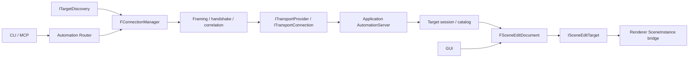

# 附着到运行中的应用

Editor 与 Viewer 的普通启动组合默认启用 `automation-local`。同一个 Windows 用户的 CLI/MCP 可以发现并附着；`--disable-plugin automation-local` 禁止该应用的发现和监听，`--kernel-only` 不创建监听器。目前实际提供 Windows 本机 Named Pipe，不开放 TCP 端口。CLI 的 `--mcp` 启动参数保持不变。

## 发现、连接与选择目标

```powershell
# 得到候选目标的 instance、application、build 和 address
hyperion_automation_cli.exe targets.list

# 把一个明确选中的运行实例作为本次命令的默认目标
hyperion_automation_cli.exe --attach <instance> engine.info
hyperion_automation_cli.exe --attach <instance> api.call --json '{"operation":"scene.info","arguments":{}}'

# 应用启动时禁用本机附着
hyperion_editor.exe --disable-plugin automation-local
hyperion_viewer.exe --disable-plugin automation-local
```

持久 JSONL/MCP 会话依次调用下面的工具。JSONL 使用 `{id,method,params}`，MCP 使用 `tools/call` 的 `name` / `arguments`；示例中的参数对象相同。

1. `targets.list`，参数 `{}`。
2. `targets.connect`，参数 `{"instance":"<选中的 instance>"}`。
3. 保存返回的 `result.connection`。后续 `engine.info`、`api.search`、`api.describe`、`types.describe`、`api.call`、`jobs.get` 和 `jobs.cancel` 均显式传 `connection`。
4. 完成后调用 `targets.disconnect`，参数 `{"connection":"<connection>"}`。

例如：

```json
{"id":"scene","method":"api.call","params":{"connection":"<connection>","operation":"scene.info","arguments":{}}}
{"id":"schema","method":"api.describe","params":{"connection":"<connection>","operation":"scene.nodes.set_transform"}}
```

`targets.connect` 不改变默认目标；省略 `connection` 时使用 `--attach` 指定的目标，没有 `--attach` 则使用独立 CLI 会话。一个前端可连接多个实例。连接失败、目标退出或 ID 过期都不会回退到独立会话，也不会自动挑选别的应用。单次 `targets.connect` 命令退出即断开，应使用持久会话，或为单次领域命令使用 `--attach`。

`--attach` 必须提供非空目标，且只能出现一次；空变量、重复选项在启动时直接报错，不能据此进入独立会话。

高级调用可以跳过发现，显式传 `{"address":{"scheme":"npipe","address":"<pipe name>"},"instance":"<expected instance>"}`。地址为 provider 自己的 opaque 字符串，不是领域资产路径；同时提供 instance 会在握手中核对。未知 scheme 返回 `unsupported_transport`。

连接到的是应用已经加载的二进制及内存状态。重新编译不会热更新已运行的应用或 MCP 前端；需重启相应进程。`engine.info` 和握手的 target/build 字段可识别运行实例及构建标签，不能代替源码热重载。

## 首批 live scene 操作

| 操作 | 契约 |
|---|---|
| `scene.info` | 当前 document、revision、节点数量、loaded/ready、busy、dirty、saving、history/canUndo/canRedo |
| `scene.nodes.list` | 当前 document + revision，offset/limit 分页；limit 为 1–100；场景变化后重新分页 |
| `scene.node.get` | document + 不透明 handle；返回名称、类型、父节点 ID、local/world 矩阵及状态 |
| `scene.nodes.set_transform` | 当前 document + revision，1–128 个不同对象的 local 矩阵；整个批次验证后提交 |
| `scene.undo` / `scene.redo` | Editor 共用 GUI 历史与选择恢复；Scene Viewer 声明 unavailable |
| `scene.save` | 明确目标进程可访问的 `.hasset` 路径；异步保存接收时的快照；之后的编辑继续保持 dirty |

查询 `scene.info`，等待 `ready:true` 且 `busy:false`，再获取节点和修改。`loaded` 只表示逻辑场景可查询；资源准备尚未结束时不代表可编辑；终止性资源失败可查询错误并修正引用。矩阵使用 `{"values":[16 个数]}`，列主序，平移为第 12–14 项；局部矩阵受父变换影响，world 是派生结果。所有 64 位整数（包含 revision 和 handle 内的 scene/generation）使用十进制字符串。

文档 ID 含随机命名空间，区分应用、文档替换和新启动。handle 必须与当前 document 一起使用，不应由节点索引猜测。编辑期间过期 revision 返回 `stale_revision`；旧文档返回 `stale_document`；已替换节点返回 `stale_handle`；准备、Inspector/gizmo 手势、拖放或模态操作期间返回 `busy`。成功变换成为 Editor 的一条撤销记录，保留选择；不会隐式写盘。返回成功表示 Main 已提交，Renderer 在后续帧发布，不表示屏幕/GPU 已完成。

资产路径、`/Game` 和保存目的地都在**目标进程**解释。`content.root.get` 可读取目标的 root；附着不会设置客户端自己的 root 来替换应用 root。`--attach` 不启动独立资产服务，不能混用 `--asset-root`、`--engine-content` 或 `--read-only`。Editor live catalog 的 asset 操作使用实际共享 workspace，root set/clear 使用共享内容参与者并保存目标偏好。Viewer 保留 CPU 资产文档和 root 查询。具体操作族见 [能力清单](AutomationCapabilities.md)。

断开前端不会关闭应用、丢弃场景或取消已经接收的保存。每个连接拥有独立 Session/Job 命名空间，共享应用文档。重连建立新 session，不能恢复旧 job ID；先重新查询共享状态。超时/断线可能发生在修改提交之后，禁止自动重放变更请求。

## 可移植通信与扩展



- `Runtime/Transport` 的 `ITransportConnection` 提供有序双向字节流、非阻塞 Poll、有限写入容量、EOF/错误和已验证的 peer 身份事实；不解释 JSON、operation、session 或“本机应用”。Send 成功仅表示数据被 provider 接收，Receive 不保留原生消息边界。缓冲区由 provider 拥有；Close 在释放缓冲区前取消/收割原生 pending IO。
- `ITransportListener` 非阻塞接受已连接、已完成底层身份验证的连接；`ITransportProvider` 按 scheme 注册 Connect/Listen。客户端 Connect 可以返回 Connecting，通过 Poll 进入 Connected，之后才进行准入验证与应用握手。
- `Runtime/Automation` 负责统一帧协议、握手、请求关联、超时、连接和 target session。握手协商协议版本与消息预算，并返回实际 instance/build/session/catalog 标识；当前协议版本 1，不支持 session resume。前端超时为 10 秒；异步领域工作用立即返回的 job 和后续查询表达。
- `ITargetDiscovery` 返回有界候选快照。候选记录不等于可连接/可信身份；最终依赖 provider 验证和握手。当前只实现本机目录发现；可以增加设备列表、显式配置或组合 discovery，而无需修改调用路由。
- `IAutomationAccessPolicy` 独立于传输。当前 `FCurrentUserAccessPolicy` 要求 provider 证明 authenticated/local/currentUser；未来远端 provider 可报告认证机制、principal 和加密事实，再由对应策略检查配对身份。不能信任 JSON 握手自己声明的身份。

Windows provider 的名字限制在本机 Hyperion 管道命名空间，拒绝远端 pipe client；私有 DACL 只允许当前用户。客户端核对 pipe server 所属用户。每次应用启动生成新 instance，发现记录位于 `%LOCALAPPDATA%/Hyperion/Automation/<user SID>/`，正常停止撤销记录。崩溃遗留记录可能仍出现在候选列表，连接时会失败，不能被当作仍然运行的实例；不依赖 PID 判断身份。

帧为 **4 字节大端长度 + UTF-8 JSON**，接收端处理分片和合并。默认最大帧为 4 MiB + 64 KiB，领域请求仍为 1 MiB；握手最多 8 KiB。每个 channel 最多 32 个待发送帧及约两帧预算，每个原生连接最多 8 MiB/128 个待发送片段。前端最多 16 个连接、每连接 32 个未答复请求；server 最多 32 个 peer，每 peer 8 个活动 job、32 个保留 job；每帧每 peer 至多接收 4 个请求。慢读方触发 backpressure 后关闭该连接，不能无限堆积结果。

新增 macOS/Linux 本机实现时，在 Transport 的私有 adapter 中实现 Unix socket 等 provider，补充平台组成入口和发现目录，复用同一套 framing/session/router。新增 PC→移动设备连接时，实现远端 provider、设备认证策略和发现来源，按需提供地址/凭据配置；不需要重写场景操作。TCP/TLS、配对界面、ADB/USB 转发、文件上传和远端服务监听均未在本版实现。

## 应用接入约束

`automation-local` 由插件生命周期拥有，依赖已封闭的 automation-session/catalog。它只在 Main 的插件 Update 边界执行请求，不能把任意网络请求直接投递为可重入的 Main task：GUI 内部 Tasks.Wait 会泵送 Main，可能正处于半完成事务中。

Editor / Scene Viewer 发布同一个 `FSceneEditDocument` 给 GUI 和 `automation-scene`。CPU 模块 `SceneEditing` 拥有事务、历史、选择、保存快照和 save point；`ISceneEditTarget` 由 Renderer 的 `FSceneInstanceEditTarget` 连接资源准备和持久化。SceneEditing 不依赖 Renderer/RHI；传输不包含场景分支。Editor 的预览手势仍由 GUI 维护，结束后提交共享服务，进行中则对 agent 显示 busy。

领域适配器通过可选 typed service 获取文档，声明 Before automation-session；共享服务要活到所有 session 的 Quiesce 排空之后。停机先撤销发现、关监听/连接和接收，再 Poll 完成已接收的保存，最后释放 document/Scene/Assets。缺失或禁用 scene provider 时可保留查询目录和 unavailable 原因；监听器失败不会销毁 GUI 场景。

应用接受退出后，后续同一轮插件 Update 也必须先关闭新请求准入；不能等到 Quiesce 才阻止场景变更。Scene Viewer 的 GUI busy 状态按帧更新，隐藏界面或窗口不可绘制时结束输入交互并丢弃旧输入缓冲，保持控制请求可用；开启的动画仍表示 busy。动画遵循共享编辑验证，临时拒绝后在后续帧重试，不能把编辑失败视为场景加载失败；无关资源未就绪也不能阻止可编辑对象的动画。原生文件路径进入文档字符串接口时统一使用 UTF-8 转换。

新增场景功能应扩展共享服务和反射请求/结果，GUI 与 agent 复用。不要在连接层识别 Editor/Viewer 类型，不要给每个客户端创建场景副本，也不要通过测试开关实现正式协议。

Scene Viewer 的属性、层级、创建/删除、光照和天空界面编辑也通过共享文档服务记录 authored state；资源加载推进 scene revision 不会单独设置 dirty。保留材质准备状态的节点复制与保留子节点删除目前仅有无历史宿主适配，历史宿主会在修改前返回 unavailable；其自动化适配仍在覆盖清单中延后。
