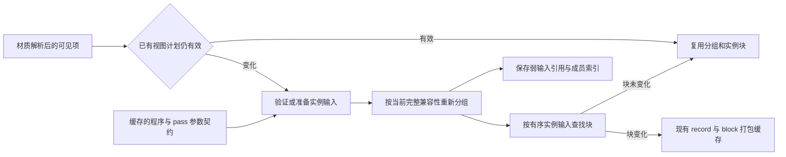

# 合批规划数据重构

本轮基线为 `85792506c96d1fdb4cd38d9b6c3c8b525da2af69`。优化目标是相机移动导致可见集变化时，规划器反复构造布局、实例值列表和整张参数快照的 CPU 成本。GPU 实例布局、可见工作、绘制顺序规则和验证配置保持兼容。

独立质量审计随后发现了默认 Debug 2048 项的缓存循环重建，以及准备缓存插入失败后的 LRU 不一致。本页的数据流与缓存边界已更新为修复方案；原交付测量保留并明确标注。审计后的结论、复测和限制见 [质量审计记录](BatchPlanningAudit.md)。

## 测量依据

基线大幅相机移动的诊断 trace 中，`PlanBatches` 为 6.895 ms/帧；其中 `BuildFreshBatchPlan` 为 4.288 ms，包含 `PrepareBatchInstanceData` 2.774 ms；`CacheBatchPlan` 为 1.764 ms。实际分组 `GroupBatchItem` 只有 0.229 ms，所有材质常量的实际打包合计约 0.031 ms。嵌套 scope 不相加。

因此本轮首先减少重复的元数据和值遍历，没有改为全局 GPU 实例槽，也没有更换分组哈希算法。普通关闭 profiling 的性能结果与诊断 trace 分开记录。

## 数据流



- `FInstanceContract` 关联不可变的已编译程序/pass，预先提取实例参数索引。已有 canonical structure 继续负责完整物理布局、图形状态和资源兼容性，块缓存不再重复复制布局和 shader 字符串。
- `FPreparedItem` 保存稳定源身份和有效实例数值的弱身份。当前强值的 owner 与地址均相同可以直接命中；不同地址的值先锁定旧弱引用，再做完整数值比较。旧值过期则保守重建，过期的非空旧值不能与空值混同。缓存的值地址从不被直接解引用。独立的验证游标记录最近一次输入状态、局部参数页、资源身份和共享覆盖；只在重新规划时更新。
- 视图计划只保存弱准备记录、最近的参数身份和成员索引。块缓存比较有序的准备记录引用，消除每次块查询时重新收集全部实例值的过程。真正变化的块仍进入既有 record/block 缓存，保持部分 record 复用、不可变字节和 GPU 上传路径。
- 自定义策略仍在观察到参数变化时重新评估；同组共享覆盖必须保持完整一致性才能复用旧分组。共享覆盖包含实例字段、被移除或已过期时，均重新验证有效实例值。

`MaterialParameterTable::FLocalIdentity` 只保存参数页的弱所有者、页修订号和覆盖掩码，不保留纹理或只读缓冲区数据。页修订号用于识别只有一个强所有者时的原地写入。旧帧仍持有自己的材料和 GPU 数据，缓存不会借此延长旧资源租约。

## 缓存边界

默认 16 MiB 实例数据字节预算分配为：完整实例块 8 MiB、既有 record/block 打包缓存 8 MiB。准备记录仅保存弱值与弱参数页身份，不拥有数值树；它与既有候选项、计划等元数据一样由数量上限限制。准备记录不再受实例字节缓存淘汰，因此无需实例 payload 的普通回退计划不会因为小字节预算而逐帧丢失全部身份。计划和块仍只持有弱准备引用，旧数值树的强保留仅发生在受字节预算限制的既有打包缓存中。

既有项与结构数量上限继续生效；准备记录最多 `MaxItems`，计划合计最多 `MaxItems` 个输入和 16 个视图/pass，程序契约关联最多 256 条。`CachedInputs` 与 `CachedInputBytes` 分别显示准备记录数量和结构性元数据估算（准备对象、页游标和弱值数组，不含 map/list 节点、分配器开销或弱引用保留的 make_shared 分配）；`CachedBytes` 显示受 `MaxBytes` 限制的实例数据缓存。二者分开，均不代表整个 Renderer 的内存总量。匿名项仍不能建立跨帧实例身份。已有候选项的失效扫描同步清除对应准备记录；对候选已被淘汰的孤立准备记录，每个 family 最多额外巡检 64 条。插入时执行数量限制，map 插入异常会回滚刚创建的 LRU 节点；分批清理不延长原生资源租约。

新增统计为 `PreparedInputBuilds`、`PreparedInputReuses` 和 `InstanceContractBuilds`。Viewer CSV 使用 `batch_input_builds`、`batch_input_reuses`、`batch_contract_builds`，另追加 `batch_cached_inputs` 与 `batch_input_bytes` 显示元数据驻留；Tracy 提供对应的 build/reuse/contract 和 cached-input plots，新增 Detail scope 为 `PrepareBatchInputs`。

## 可重复比较

`batch_planning_benchmark` 调用真实 `FRenderBatchSystem::Build`。D3D12 材质和 shader 初始化、输入构造以及每项恰好覆盖一次的检查均在计时区间之外。每项测试使用 1536 个存活源项、1024 个可见项、容量为 4 的真实 typed instance shader，固定 80 次预热；包含稳定、共享变化、小/大可见集移动、共享与可见集同时变化、顺序反转、单项数值变化和动态状态拆组。它测量规划 CPU 路径，不能替代 SceneViewer 的完整帧测量。

```powershell
.\tools\Build.ps1 -Preset debug -Target batch_planning_benchmark
python tools/BatchPlannerComparison.py --kind planner `
  --baseline <frozen-benchmark.exe> --candidate out/build/debug/bin/batch_planning_benchmark.exe `
  --output out/planner-comparison --samples 200 --trials 2

python tools/BatchPlannerComparison.py --kind viewer `
  --baseline <frozen-viewer.exe> --candidate out/build/debug/bin/hyperion_viewer.exe `
  --output out/viewer-comparison --warmup 200 --samples 200 --trials 2
```

比较脚本交替运行基线与候选，保留二进制 SHA-256、命令、原始 CSV、日志和汇总。Viewer 使用完整 Showcase、隐藏窗口、关闭 UI 与 VSync，分别测试静止、0.1 和 10 的相机步长；检查模型全部就绪、零验证错误、逐帧源覆盖和阴影工作量一致，以及最终 PNG 完全相同。

审计前交付证据目录为 `out/batch-planner-refactor-20260909`，当时的候选程序位于 `delivery-*`，其 SHA-256 记录在 `DeliveryHashes.json`；Renderer 源码哈希位于 `DeliverySourceHashes.json`。审计修复后的程序和测量保存在 `out/batch-planner-audit-20260909/fixed-*` 及对应比较目录，详见 [质量审计记录](BatchPlanningAudit.md)。


## 审计前交付测量

以下均为两轮交替顺序测量的均值，每个版本、每种输入合计 400 个测量样本。负百分比表示耗时下降。完整原始数据及每轮分布位于证据目录，`DeliveryAggregate.json` 为汇总。

### 真实规划器 CPU 基准

| 输入 | Debug 基线 → 候选（ms） | 变化 | Release 基线 → 候选（ms） | 变化 |
| --- | ---: | ---: | ---: | ---: |
| 稳定 | 1.5904 → 1.6836 | +5.9% | 0.0984 → 0.0958 | -2.7% |
| 仅共享值更新 | 1.7485 → 1.7645 | +0.9% | 0.1062 → 0.1138 | +7.2% |
| 小可见集变化 | 20.4490 → 14.7351 | -27.9% | 1.1795 → 0.8078 | -31.5% |
| 大可见集变化 | 20.9910 → 16.4918 | -21.4% | 1.2979 → 0.9166 | -29.4% |
| 可见集与共享值同时变化 | 21.2527 → 16.6863 | -21.5% | 1.4218 → 0.9343 | -34.3% |
| 顺序反转 | 16.7109 → 12.4366 | -25.6% | 1.0860 → 0.6986 | -35.7% |
| 单项实例值变化 | 10.8947 → 8.0908 | -25.7% | 0.6236 → 0.4003 | -35.8% |
| 动态状态拆组 | 22.3272 → 19.1266 | -14.3% | 1.7401 → 1.0884 | -37.5% |

变化输入的收益覆盖不同可见集合、顺序、数值和状态，未依赖 SceneViewer 的 40 帧运动周期。回退也存在：Debug 稳定输入增加约 0.093 ms；Release 仅共享值更新增加约 0.008 ms。准备记录校验和额外间接访问仍有固定成本。

### 完整 SceneViewer

“总规划”为主视图 `plan_ms` 与全部阴影视图 `shadow_plan_ms` 之和；管线准备使用 `pipeline_prepare_ms`。

| 配置 / 相机 | 总规划 ms（基线 → 候选） | 变化 | 管线准备 ms（基线 → 候选） | 整帧 ms（基线 → 候选） |
| --- | ---: | ---: | ---: | ---: |
| Debug / 静止 | 0.0000 → 0.0000 | +0.0% | 1.4462 → 1.4517 | 2.3536 → 2.3898 |
| Debug / 小幅移动 | 1.6347 → 1.2762 | -21.9% | 14.8410 → 13.0123 | 16.2518 → 14.3125 |
| Debug / 大幅移动 | 9.0477 → 5.7484 | -36.5% | 26.8761 → 22.5398 | 28.4520 → 24.0461 |
| Release / 静止 | 0.0000 → 0.0000 | +0.0% | 0.0887 → 0.0882 | 1.5670 → 1.5542 |
| Release / 小幅移动 | 0.1700 → 0.1204 | -29.2% | 0.9568 → 0.8268 | 1.8598 → 1.3376 |
| Release / 大幅移动 | 0.6775 → 0.5109 | -24.6% | 1.5939 → 1.4859 | 2.4551 → 2.5598 |

运行时间有明显波动，尤其是 Release 的整帧等待。大幅移动的 Release 两轮整帧变化分别为 +12.4% 和 -7.9%，均值为 +4.3%，因此不能据此宣称稳定的整帧/FPS 收益；两轮总规划 CPU 时间均下降。静止时视图缓存直接绕过规划器，总规划为零，静止帧时间变化不能归因于规划加速。

最终矩阵为 24 次运行、12 个配对，逐帧核对 2400 对测量帧：模型 79/79 就绪、失败项与 GPU 验证错误为零、源覆盖/主视图绘制/阴影工作量相同，配对 PNG 严格一致。目录为 `PlannerDebugDelivery`、`PlannerReleaseDelivery`、`ViewerDebugDeliveryVerified`、`ViewerReleaseDelivery`。

此前一次 `ViewerDebugDelivery` 小幅移动校验停在单像素差异（最大通道差 42）。同一冻结基线自身产生了两种图像；追加的基线 3 次和候选 3 次运行全部逐字节一致，也与初始候选相同。原始失败配对与 `ImageRepeat/Evidence.json` 保留。没有放宽像素容差，最终矩阵使用新目录重新严格验证；这仍提示该场景的逐字节可重复性有边界。

### 审计前诊断 trace 与归因参考

同一基线 trace 可执行文件的 SHA-256 已核对。双方均为 Debug + Tracy Detail、200 帧预热和 200 帧捕获；这些数值用于归因，不与关闭 profiling 的表格混合。

| scope | 小幅：基线 → 候选 ms/帧 | 大幅：基线 → 候选 ms/帧 |
| --- | ---: | ---: |
| `PlanBatches` | 1.4408 → 1.1311 | 6.8951 → 4.2491 |
| `PrepareBatchInstanceData` | 0.1818 → 0.0561 | 2.7735 → 1.2380 |
| `CacheBatchPlan` | 0.1396 → 0.0053 | 1.7635 → 0.0778 |
| `PrepareBatchInputs` | 0.0000 → 0.0714 | 0.0000 → 0.8937 |
| `DescribeCachedBatchItem` | 0.0675 → 0.0693 | 0.9649 → 0.8629 |
| `GroupBatchItem` | 0.0146 → 0.0156 | 0.2294 → 0.2230 |
| `RetireBatchFamily` | 0.2238 → 0.2045 | 0.3303 → 0.2564 |
| `PackMaterialConstants` | 0.0265 → 0.0267 | 0.0308 → 0.0291 |

在这组审计前 trace 中，值得继续定位的是准备输入（0.894 ms）与候选描述（0.863 ms）的重复查表/校验，以及变化块的实例数据准备（1.238 ms）。分组约 0.223 ms、实际常量打包约 0.029 ms，当前优先级较低。进一步重构应继续测量真实可见集、共享值和自定义策略路径。

## 审计前迭代与验证记录

- 初稿采用准备/完整块各 4 MiB 固定分区。Debug 的 1024 个 typed 记录略超准备分区，导致稳定基准从约 1.5 ms 恶化到约 25 ms，而另一分区仍空闲。当时改成共享 8 MiB 规划池，并加入小预算稳定复用回归，以及基准预热后的稳定计划断言。独立审计随后发现更大稳定输入仍会循环重建，最终以本页所述弱身份与数值缓存分离方案取代共享规划池。原有 262144 字节、16 项的计划回收测试预算保持不变。
- 新准备缓存的全量失效扫描抵消了小幅运动的部分收益；改为既有扫描同步清理加每 family 最多 64 条孤立记录巡检，并验证孤立记录最终回收。硬预算始终在插入时执行。
- 保留并通过既有像素/旧帧、完整兼容性、透明顺序屏障、自定义策略、共享实例字段、匿名项、多视图、失败组与预算测试。新增准备输入复用、单项变化、生成代数、覆盖移除、弱页原地写入、即时资源回收和孤立记录清理测试。
- 完整构建覆盖 Debug、Release、Release + Tracy，以及 Debug + Tracy 诊断 Viewer。完整 CTest 检查覆盖 Debug 48 项和 Release 43 项：Debug 初次仅固定预算隔离测试失败，共享池修复后相关测试复跑通过；Release 完整 43 项通过。最终运行时再通过 Debug/Release 的实例、场景与移动相机验收各 3 项，以及 profiling 实例与 trace 验收 2 项；原预算恢复后再次单独验证三种配置的实例测试。
- 全库格式/路径检查通过（302 个源文件），修改涉及的 10 个 C++ 翻译单元命名检查通过，293 个实现文件/25 个模块的依赖边界检查通过。OpenSpec 严格验证与最终差异检查一并保留。

验证范围是本机 D3D12 / RTX 5080；没有新增后端或改变 GPU ABI。
