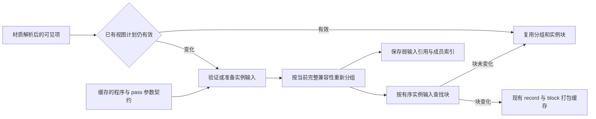

# 合批规划数据重构

合批规划器复用材质契约、准备输入和不可变实例块，减少可见集变化时重复遍历元数据的成本。

## 数据流

```mermaid
flowchart LR
    A[材质解析后的可见项] --> B{已有视图计划仍有效}
    B -->|有效| C[复用分组和实例块]
    B -->|变化| D[验证或准备实例输入]
    E[缓存的程序与 pass 参数契约] --> D
    D --> F[按当前完整兼容性重新分组]
    F --> G[按有序实例输入查找块]
    G -->|块变化| H[现有 record 与 block 打包缓存]
    G -->|块未变化| C
    F --> I[保存弱输入引用与成员索引]
```

- `FInstanceContract` 关联不可变的已编译程序/pass，预先提取实例参数索引。已有 canonical structure 继续负责完整物理布局、图形状态和资源兼容性，块缓存不再重复复制布局和 shader 字符串。
- `FPreparedItem` 保存稳定源身份和有效实例数值的弱身份。当前强值的 owner 与地址均相同可以直接命中；不同地址的值先锁定旧弱引用，再做完整数值比较。旧值过期则保守重建，过期的非空旧值不能与空值混同。缓存的值地址从不被直接解引用。独立的验证游标记录最近一次输入状态、局部参数页、资源身份和共享覆盖；只在重新规划时更新。
- 视图计划只保存弱准备记录、最近的参数身份和成员索引。块缓存比较有序的准备记录引用，消除每次块查询时重新收集全部实例值的过程。真正变化的块仍进入既有 record/block 缓存，保持部分 record 复用、不可变字节和 GPU 上传路径。
- 自定义策略仍在观察到参数变化时重新评估；同组共享覆盖必须保持完整一致性才能复用旧分组。共享覆盖包含实例字段、被移除或已过期时，均重新验证有效实例值。

`MaterialParameterTable::FLocalIdentity` 只保存参数页的弱所有者、页修订号和覆盖掩码，不保留纹理或只读缓冲区数据。页修订号用于识别只有一个强所有者时的原地写入。旧帧仍持有自己的材料和 GPU 数据，缓存不会借此延长旧资源租约。

## 缓存边界

默认 16 MiB 实例数据字节预算分配为：完整实例块 8 MiB、既有 record/block 打包缓存 8 MiB。准备记录仅保存弱值与弱参数页身份，不拥有数值树；它与既有候选项、计划等元数据一样由数量上限限制。准备记录不再受实例字节缓存淘汰，因此无需实例 payload 的普通回退计划不会因为小字节预算而逐帧丢失全部身份。计划和块仍只持有弱准备引用，旧数值树的强保留仅发生在受字节预算限制的既有打包缓存中。

既有项与结构数量上限继续生效；准备记录最多 `MaxItems`，计划合计最多 `MaxItems` 个输入和 16 个视图/pass，程序契约关联最多 256 条。`CachedInputs` 与 `CachedInputBytes` 分别显示准备记录数量和结构性元数据估算（准备对象、页游标和弱值数组，不含 map/list 节点、分配器开销或弱引用保留的 make_shared 分配）；`CachedBytes` 显示受 `MaxBytes` 限制的实例数据缓存。二者分开，均不代表整个 Renderer 的内存总量。匿名项仍不能建立跨帧实例身份。已有候选项的失效扫描同步清除对应准备记录；对候选已被淘汰的孤立准备记录，每个 family 最多额外巡检 64 条。插入时执行数量限制，map 插入异常会回滚刚创建的 LRU 节点；分批清理不延长原生资源租约。

新增统计为 `PreparedInputBuilds`、`PreparedInputReuses` 和 `InstanceContractBuilds`。Editor CSV 使用 `batch_input_builds`、`batch_input_reuses`、`batch_contract_builds`，另追加 `batch_cached_inputs` 与 `batch_input_bytes` 显示元数据驻留；Tracy 提供对应的 build/reuse/contract 和 cached-input plots，新增 Detail scope 为 `PrepareBatchInputs`。

性能采集入口与当前 Editor 工作负载约束见 [渲染诊断](RenderDiagnostics.md)。
