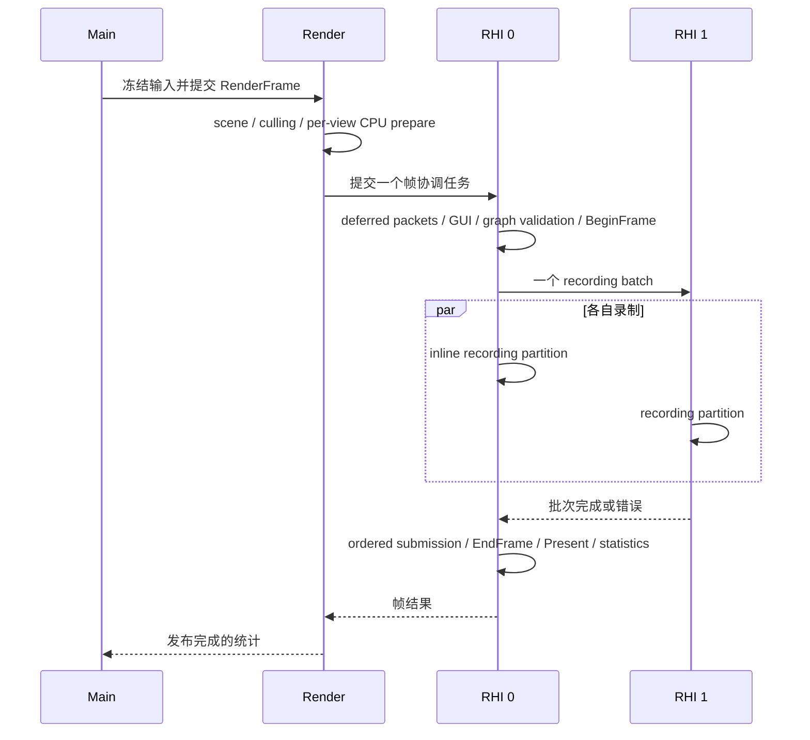

# 保留渲染准备结果与帧调度优化

本轮基于 `optimize-renderer-cpu-submission` 开发完成后的源码和二进制继续优化。第一轮结果见 [RendererCpuPerformance.md](RendererCpuPerformance.md)。二进制 SHA-256、源码快照及新证据保存在 `out/retained-render-20260909`；正式数字使用 Tracy 编译关闭的 Debug/Release，定位使用 Profile。

下文的完整扫描和历史 trace 数字来自独立审计前的实现。后续正确性修复、复审结果及其性能复测单独记录于 [RendererCpuAudit.md](RendererCpuAudit.md)。

## 优化前的实际负载

上一轮 Profile 的 scope 为包含子 scope 的耗时，不能相加当作总帧时间。以下是每帧累计 CPU 毫秒；600 draw 关闭 culling/instancing/shadows，CSM 为默认场景五个 view 的总和。

| 路径 | 600 静止 | 600 移动 | CSM 静止 | CSM 移动 |
|---|---:|---:|---:|---:|
| Main UpdateScene | 0.325 | 0.411 | 0.101 | 0.103 |
| CollectScene | 0.146 | 0.180 | 0.140 | 0.141 |
| PrepareSceneSnapshot | 0.078 | 0.077 | 0.171 | 0.171 |
| PrepareMaterials | 0.183 | 1.143 | 0.226 | 1.120 |
| CommitMaterialEvaluation | 0 | 0.270 | 0 | 0.234 |
| PrepareDraws | 0.317 | 0.911 | 0.136 | 0.199 |
| RecordNativeDraws | 1.112 | 1.120 | 0.181 | 0.183 |

静止时仍遍历 scene/model/primitive/item，复制参数和 packet 容器，查询材质 readiness，准备每个 pass，并写回每个 draw 的诊断。移动时额外反复提交约 600 个材质 evaluation，虽然 View provider 实际只求值少量次，per-item 的复制、引用计数、比较和 commit 仍存在。D3D12 已缓存实际 graphics state 绑定，但录制循环依然解析每个 packet，执行检查、状态比较和 API draw。

`SceneBridge::PrepareChanges` 过去每次扫描 `Scene.GetHandles()`，即使没有逻辑变更也构造材质版本列表；SceneViewer 再对每个模型调用 readiness/error 检查。`BuildPasses` 过去每个 view 末尾都会 `Owner.Schedule()`。Frame/Pass 的 scope lifetime 释放也无条件请求资源维护，所以静态 ready scene 仍会产生 Worker 延迟任务和 RHI 缓存扫描。

## 等待边界的审计

普通隐藏 GUI 的帧路径原有以下同步：

| 发起方 | 等待对象 | 数据依赖 / 原因 |
|---|---|---|
| Main | RenderFrame task | 本帧冻结输入、结果及诊断回收 |
| Render | BuildViews 的 RHI 0 preparation | GPU 资源与 packet 物化完成后才能加入 graph |
| Render | RHI 0 BeginFrame | 选择 frame slot、等待其 GPU fence、重置分配器 |
| Render | 每个 graph recording task | 所有命令列表关闭后才能提交 |
| Render | RHI 0 EndFrame | 有序提交、Present、可选 readback 和统计 |

600 draw 为两条命令列表，因此总计六个 Wait；CSM 为六条列表，因此十个 Wait。GUI prepare、depth preview、RenderDoc capture 还可能增加往返。场景修改/启动/关闭的控制任务另行计数，不能混入稳定每帧路径。

`FTaskSystem::Wait` 在 Main 会 pump Main queue 并通过条件变量等待；在 Render/RHI 专用线程通过完成条件变量等待。仅 Worker 使用可恢复挂起。同一专用 executor 的未完成 task 不能被自身同步等待。当前 `Wait(Dispatch(...))` 没有无条件的 1 ms 延迟，但会强制串行阶段和队列往返，丢失调用者继续做有用工作的机会。

Tracy 中静止 600 draw 的 TaskWait 累计 5.12 ms，而完整帧约 3.20 ms，因为 Main 等 Render 时 Render 又等 RHI，区间重叠。不能据此声称删除 Wait 就会节省 5.12 ms。BeginFrame 的 FenceWait 和 Present 的等待也是独立原因；需要结合任务 dispatch/执行/完成时间与线程轨迹解释关键路径。

## 完成的实现

- `SceneBridge` 消费逻辑 scene 的变更记录，仅检查使用可编辑材质的 attachment 的版本。完全静态的就绪场景不再遍历所有模型；SceneViewer 状态由 bridge/status 和资源发布版本共同失效。
- Render scene 为稳定的内置 primitive 发布 collection revision。`SessionViewCache` 同时检查 scene/resource revision、实际 culling/sort 矩阵、view/family、viewport（包含深度范围）、视图参数、附件和材质依赖。静态视图复用 collection、resolved material、batch plan 和内容标识。关闭 culling 的不透明视图可以在相机移动时保留 collection，但仍更新依赖 View 的参数。自定义 primitive 默认不声明稳定，Frame/Pass/Draw 依赖和自定义 batch strategy 保留原有求值路径。
- 相机更新时，同一个 view 的材质 evaluation 共享不可变的 engine scope block；Object/Material/Draw 保持各自所有权。提交新结果时替换共享 block，避免逐项复制全部 scope key/lifetime。旧帧引用旧值，覆盖层和 scope block 不串联历史帧。
- `ScenePassCache` 根据 Render 内容标识和资源发布版本保留不可变 draw vector。Graph 的 consume 路径和 `RecordOwned()` 传递同一份数据。缓存命中后按本帧实际视图顺序重新发布成功回执，确保视图换序或移除时 `DrawResult` 的 frame/family/view 仍正确。
- D3D12 为每个 recording context 保留弱所有权的原生操作计划。首次完整验证通过后，重复的不可变 stream/附件组合可以编译并复用必要的 PSO、geometry、root、heap、CBV、table、dynamic state 和 draw 操作序列。每条命令列表仍设置其初始状态，并记录所有实际 draw API。借用式 `Record()` 继续快照并完整验证；新 stream、目标变化、错误 geometry 或资源仍走检查。
- 原生计划不延长 GPU 资源生命期；不可变 stream 本身持有全部资源。常量页额外记录弱命令使用凭据，覆盖 shared stream 和 inline owned commands；登记、发布检查和 reset 使用同一页锁。`ResetConstantBuffer` 同时要求唯一 buffer 句柄与所有命令使用者失效，防止多层共享 owner 只包含一份嵌套句柄时提前重置。场景变更主动清除批次计划的参数所有权，普通 family 退休也会移除 emitted owner 失效的计划。
- Deferred scene/depth 准备持有现有资源协调器的 `FRenderResourcePreparation` 句柄；GUI 在执行时取得仍存活的 plugin 状态凭据。owner 关闭或销毁后，graph 在获取 GPU 帧前受控拒绝。首次 native Close 失败后可以重试剩余清理。
- 就绪 view 准备、未被资源实际使用的 Frame/Pass lifetime 释放不再调度维护。创建、上传、失败、资源释放和待完成 fence 仍驱动维护。静态 CSM 还复用 caster/projection setup；缓存键包含真实 camera/light/settings 和 scene/resource revision。没有 revision 的动态查询接口继续查询。四个 cascade 每帧照常渲染。

相关实现入口：[SessionViewCache.cpp](../Source/Runtime/Renderer/Private/SessionViewCache.cpp)、[ScenePassCache.cpp](../Source/Runtime/Renderer/Private/ScenePassCache.cpp)、[SessionMaterialEvaluation.cpp](../Source/Runtime/Renderer/Private/SessionMaterialEvaluation.cpp)、[D3D12DrawPlan.cpp](../Source/Backends/D3D12/Private/D3D12DrawPlan.cpp)。

## 新的帧同步边界



普通 Viewer 使用一个 Main→Render wait、一个 Render→RHI wait。两个 RHI executor 时，协调任务再统一 join 一个 peer；CSM 的多个 pass 不会增加逐 pass dispatch/wait。RHI 0 自己的 partition 直接执行。GUI、depth preview 和 RenderDoc 的帧前/帧后操作进入相同协调边界。仍支持原来的 immediate API，外部调用它时仍可产生自己的同步。

Graph 在 BeginFrame 前展开并验证 deferred entries，正确翻译展开后的依赖索引。录制失败时先 join 所有已接收的 peer，再 cancel frame，保留最初错误并允许下一帧重试。低 draw 时的 GPU frame-slot fence 和 Present 等待仍然存在；减少 CPU 排队不会使这些等待自动消失。

此外，本轮移除闲置维护后暴露出旧 GPU timing capture 的边界问题：上一个 capture 或 capture 开始前提交的帧，可能在稍后完成时进入当前 capture。现在给 submission 标注 capture epoch，仅把当前 epoch 的完成结果加入 capture，同时仍更新一般 GPU 统计。该修复没有新增 wait/flush，并有受控 queue gate 的确定性测试。

相关实现：[RenderGraphPreparation.cpp](../Source/Runtime/Renderer/Private/RenderGraphPreparation.cpp)、[RenderGraphExecution.cpp](../Source/Runtime/Renderer/Private/RenderGraphExecution.cpp)、[ViewerFrame.cpp](../Source/Applications/Viewer/Private/ViewerFrame.cpp)。

## 测量方法与完整结果

2026-09-09，本机 Windows / Ryzen 9 9950X3D / RTX 5080，1440×900，4 worker / 2 RHI，D3D12 debug layer 开启。GUI、VSync 关闭，隐藏窗口；Debug 保留 `/Od /Ob0 /RTC1`，Release 保留 `/O2 /Ob2`。正式 A/B 均编译关闭 Tracy；Debug 编译支持 RenderDoc，但计时未启用捕获。所有基准串行执行，计时期间不并行运行编译或 GPU 测试。

普通绘制使用同一个低几何量模型的重复实例，关闭 culling、instance batching 和 shadows；默认 Showcase 为 79 个就绪模型，CSM 保留四个 cascade。每项预热 200 帧，两个交替顺序轮次各采样 400 帧，合并 800 个样本；完整扫描共 48,000 个正式样本。均值/P95/P99 从全部原始样本计算，不剔除离群帧。原始命令、CSV、二进制 SHA-256 和逐轮分布见 [Debug Summary](../out/retained-render-20260909/final-debug/Summary.json)、[Release Summary](../out/retained-render-20260909/final-release/Summary.json)；合并结果见 [FinalAggregate.json](../out/retained-render-20260909/FinalAggregate.json)。

`frame_ms` 是完整 Viewer 帧耗时。新版 deferred 路径的 `pipeline_prepare_ms` 为 Render 准备时间加 RHI 物化的 CPU 时间；旧版该计数还包含同步 preparation 的队列等待，因此它可定位阶段，不能把全部差值视为纯计算收益。最终性能结论以完整帧和下面分阶段 trace 为准。

### 600 draw 与默认 CSM

表格中的“上一轮”是本轮开始前保存的第一轮优化版本。单位 ms，每格为均值 / P95 / P99。

| 配置 | 负载 | 相机 | 上一轮 | 本轮 | 均值减少 |
| --- | --- | --- | ---: | ---: | ---: |
| Debug | 600 draw | 静止 | 21.474 / 22.851 / 23.859 | 2.772 / 4.911 / 5.657 | 87.1% |
| Debug | 600 draw | 移动 | 31.936 / 33.657 / 34.740 | 22.185 / 24.058 / 24.927 | 30.5% |
| Debug | Showcase CSM | 静止 | 15.536 / 16.785 / 17.531 | 2.642 / 4.625 / 5.115 | 83.0% |
| Debug | Showcase CSM | 移动 | 24.828 / 29.367 / 31.414 | 21.919 / 27.909 / 30.497 | 11.7% |
| Release | 600 draw | 静止 | 3.574 / 5.478 / 7.869 | 2.169 / 4.299 / 4.917 | 39.3% |
| Release | 600 draw | 移动 | 4.536 / 5.646 / 6.359 | 3.500 / 4.576 / 4.942 | 22.8% |
| Release | Showcase CSM | 静止 | 3.201 / 4.962 / 5.560 | 2.427 / 4.943 / 5.646 | 24.2% |
| Release | Showcase CSM | 移动 | 3.215 / 4.709 / 5.190 | 3.238 / 5.095 / 6.310 | -0.7% |

### 完整普通 draw 扫描

| 配置 | draw 数 | 相机 | 上一轮均值 / P95 / P99 (ms) | 本轮均值 / P95 / P99 (ms) | 均值减少 |
| --- | ---: | --- | ---: | ---: | ---: |
| Debug | 0 | 静态 | 2.163 / 4.390 / 4.899 | 2.455 / 4.815 / 5.769 | -13.5% |
| Debug | 1 | 静态 | 2.919 / 5.238 / 5.932 | 2.264 / 4.653 / 5.574 | 22.5% |
| Debug | 1 | 移动 | 2.683 / 4.607 / 5.175 | 2.562 / 4.663 / 5.280 | 4.5% |
| Debug | 100 | 静态 | 4.173 / 4.895 / 6.108 | 2.426 / 5.248 / 6.225 | 41.9% |
| Debug | 100 | 移动 | 6.429 / 7.109 / 7.448 | 4.706 / 5.324 / 5.623 | 26.8% |
| Debug | 300 | 静态 | 10.695 / 11.754 / 12.351 | 2.435 / 4.771 / 5.631 | 77.2% |
| Debug | 300 | 移动 | 16.399 / 17.485 / 18.174 | 11.322 / 12.127 / 12.614 | 31.0% |
| Debug | 600 | 静态 | 21.474 / 22.851 / 23.859 | 2.772 / 4.911 / 5.657 | 87.1% |
| Debug | 600 | 移动 | 31.936 / 33.657 / 34.740 | 22.185 / 24.058 / 24.927 | 30.5% |
| Debug | 1200 | 静态 | 43.240 / 45.711 / 46.936 | 3.168 / 4.579 / 5.323 | 92.7% |
| Debug | 1200 | 移动 | 63.634 / 66.661 / 68.655 | 43.115 / 45.730 / 48.466 | 32.2% |
| Release | 0 | 静态 | 2.020 / 4.769 / 5.219 | 1.887 / 4.847 / 5.567 | 6.6% |
| Release | 1 | 静态 | 1.971 / 4.508 / 5.092 | 1.696 / 4.472 / 4.845 | 14.0% |
| Release | 1 | 移动 | 1.921 / 4.513 / 5.894 | 1.988 / 4.532 / 5.122 | -3.5% |
| Release | 100 | 静态 | 2.104 / 4.338 / 4.876 | 2.345 / 4.733 / 5.742 | -11.5% |
| Release | 100 | 移动 | 2.402 / 4.591 / 5.173 | 2.094 / 4.342 / 4.879 | 12.8% |
| Release | 300 | 静态 | 2.828 / 4.787 / 5.256 | 2.020 / 4.324 / 4.846 | 28.6% |
| Release | 300 | 移动 | 2.936 / 4.597 / 5.172 | 2.561 / 4.483 / 5.423 | 12.8% |
| Release | 600 | 静态 | 3.574 / 5.478 / 7.869 | 2.169 / 4.299 / 4.917 | 39.3% |
| Release | 600 | 移动 | 4.536 / 5.646 / 6.359 | 3.500 / 4.576 / 4.942 | 22.8% |
| Release | 1200 | 静态 | 6.805 / 7.678 / 8.153 | 2.797 / 4.467 / 4.961 | 58.9% |
| Release | 1200 | 移动 | 10.384 / 11.390 / 11.909 | 7.328 / 8.276 / 8.937 | 29.4% |

静止的 Debug pipeline 准备在 1/100/300/600/1200 draw 下均约 0.24–0.25 ms，Release 约 0.023 ms；逐项准备已消除，实际录制仍随 draw 数增长。0/1 draw 的整帧均值和尾部波动明显，不能用整帧时间除以 draw 数估计单次 API 成本。

### Release 默认移动场景复测

完整扫描中默认移动前向场景出现约 20.9% 的整帧回退，移动 CSM 也没有整帧收益。为核实这一结果，追加独立的四轮交替复测，每轮预热 200 帧、采样 800 帧，共 12,800 个正式样本。原扫描结果保留不变；复测结果见 [ReleaseMotionRecheckAggregate.json](../out/retained-render-20260909/ReleaseMotionRecheckAggregate.json)。

| 移动负载 | 上一轮整帧均值 / P95 | 本轮整帧均值 / P95 | 上一轮 pipeline | 本轮 pipeline |
| --- | ---: | ---: | ---: | ---: |
| 前向 | 2.435 / 4.813 | 2.344 / 4.548 | 0.633 | 0.579 |
| CSM | 3.335 / 4.825 | 3.343 / 5.018 | 2.024 | 1.812 |

复测没有再现移动前向场景的大幅回退，但移动 CSM 的完整帧时间仍基本持平，P95 没有改善。本轮确认的是 CPU 准备减少；不能宣称 Release 默认移动 CSM 的帧率已经提高。

### 独立原生录制与每 draw 成本

`submission_benchmark` 的计时仅包围 `Record(0)` 或 `RecordOwned(0)`，排除 BeginFrame、EndFrame、Present 和帧间 fence 等待。每个 workload 的 pipeline、geometry、constants 和 texture 保持相同。上一轮仅有借用式基准；本轮同时测借用式和 `--owned` 不可变输入。单位 ms，均为两轮 800 样本的均值。

| draw 数 | Debug 上一轮借用 | Debug 本轮借用 | Debug 本轮 owned | Release 上一轮借用 | Release 本轮借用 | Release 本轮 owned |
| ---: | ---: | ---: | ---: | ---: | ---: | ---: |
| 0 | 0.0638 | 0.0727 | 0.0641 | 0.0564 | 0.0475 | 0.0543 |
| 1 | 0.0862 | 0.0889 | 0.0712 | 0.0628 | 0.0729 | 0.0678 |
| 100 | 0.2887 | 0.2743 | 0.1950 | 0.1905 | 0.1820 | 0.1706 |
| 300 | 0.6741 | 0.6749 | 0.4020 | 0.4228 | 0.4223 | 0.3814 |
| 600 | 1.1811 | 1.2243 | 0.7054 | 0.7506 | 0.7529 | 0.6802 |
| 1200 | 2.2432 | 2.2761 | 1.3012 | 1.4183 | 1.4126 | 1.2697 |

全 draw 扫描线性拟合的边际录制成本：Debug 上一轮借用 1.801 → 本轮借用 1.835 / owned 1.025 μs/draw；Release 1.129 → 1.127 / 1.008 μs/draw。借用式路径保持完整复制/验证，Debug 均值略增；主要收益来自 owned 静态路径。这里仍包含原生 API、debug layer、wrapper 和必要状态绑定，不是裸 `DrawIndexedInstanced` 的独立计时。

所有 native 运行都创建 4 个 command list、重置 7196 次，执行 3000 次 pipeline bind、9000 次 geometry bind、9000 次 dynamic bind，验证错误为 0；没有减少 draw 或必需的状态操作来获得收益。见 [native-final/Summary.json](../out/retained-render-20260909/native-final/Summary.json) 与 [NativeFinalAggregate.json](../out/retained-render-20260909/NativeFinalAggregate.json)。

## 正常链路的最终归因

以下来自相同参数的 Profile/Tracy 200 帧窗口。单位为每帧累计 ms；各行是 inclusive scope，嵌套项不能相加，并行线程工作量也不能直接当作帧延迟。完整 trace、GPU spans、操作计数和 hash 见 [FinalTraceSummary.json](../out/retained-render-20260909/FinalTraceSummary.json)。

| scope | 600 静止（上一轮 → 本轮） | 600 移动 | CSM 静止 | CSM 移动 |
| --- | ---: | ---: | ---: | ---: |
| UpdateScene | 0.335 → 0.003 | 0.411 → 0.004 | 0.103 → 0.004 | 0.098 → 0.003 |
| CollectScene | 0.150 → 0.000 | 0.183 → 0.000 | 0.141 → 0.000 | 0.139 → 0.129 |
| PrepareSceneSnapshot | 0.092 → 0.000 | 0.081 → 0.000 | 0.154 → 0.000 | 0.168 → 0.133 |
| PrepareMaterials | 0.186 → 0.000 | 1.123 → 0.910 | 0.221 → 0.000 | 1.143 → 0.869 |
| CommitMaterialEvaluation | 0.000 → 0.000 | 0.261 → 0.099 | 0.000 → 0.000 | 0.240 → 0.176 |
| PlanBatches | 0.026 → 0.000 | 0.029 → 0.029 | 0.087 → 0.000 | 0.238 → 0.213 |
| PrepareDraws | 0.329 → 0.001 | 0.900 → 0.994 | 0.124 → 0.003 | 0.197 → 0.183 |
| BindMaterialConstants | 0.000 → 0.000 | 0.450 → 0.480 | 0.000 → 0.000 | 0.060 → 0.056 |
| ValidateDraws | 0.081 → 0.000 | 0.095 → 0.088 | 0.011 → 0.000 | 0.010 → 0.009 |
| RecordNativeDraws | 1.134 → 1.025 | 1.108 → 1.146 | 0.191 → 0.168 | 0.179 → 0.176 |
| FenceWait | 0.201 → 0.709 | 0.000 → 0.073 | 1.860 → 2.162 | 0.612 → 0.844 |
| PresentWait | 0.096 → 0.075 | 0.169 → 0.108 | 0.083 → 0.079 | 0.083 → 0.077 |

- 静止 600 draw 和静止 CSM 的 collection、material evaluation、batch planning、材质常量准备（`BindMaterialConstants`）和 resource maintenance 调用数均为 0。每帧 `PrepareDraws` 只进入缓存门面，600 draw 约 0.001 ms、CSM 五个 view 合计约 0.003 ms；不可把该 scope 的存在误认为又遍历了全部 packet。空 Present pass 的原有 validation 仍运行。
- 移动 600 draw 关闭 culling 且为不透明项，collection 同样为 0；主要工作在 597 次/帧的材质 refresh、commit 和常量绑定。材质 prepare 约 0.910 ms，其中 commit 0.099 ms；RHI prepare 0.994 ms，其中常量绑定/准备 0.480 ms；native draw 1.146 ms。本轮没有消除这段逐 item 的 packet/常量准备，该阶段在此 trace 中还略有上升。
- 移动 CSM 平均每帧重新准备 4.375 个 view；真正不变的 view 才复用。收集约 0.129 ms、快照 0.133 ms、材质 0.869 ms、batch plan 0.213 ms、RHI prepare 0.183 ms，native draw 0.176 ms。材质刷新仍比 culling 贵，不能仅继续缩减 BVH 查询来解决剩余成本。
- 静止 600 draw 的整个 Profile 帧约 2.047 ms，其中 native draw 1.025 ms、frame-slot fence wait 0.709 ms、Present 0.075 ms。CPU 更早完成准备后会更早到达 fence，观察到的 fence wait 反而增加；这不是新增的任务同步，也不等于 shader 的执行时间。
- 静止 600 draw 的原生状态操作保持为每帧 1 次 PSO、1 次 root、1 次 heap、3 次 geometry、3 次 dynamic、2 次 table 和 604 次 CBV bind。各 Object 的常量切片地址仍不同，所以原生录制不仅包含 600 次 draw API。静态缓存消除了检查和规划，不能把仍存在的 CBV API 成本误称为重复材质求值。

### Wait 是否产生了额外等待

| 路径 | Main 等 Render | Render 等 RHI | RHI coordinator join | 总 Wait 调用 / 帧 |
| --- | ---: | ---: | ---: | ---: |
| 上一轮 600 draw | 1 | 5 | 0 | 6 |
| 本轮 600 draw | 1 | 1 | 1 | 3 |
| 上一轮 CSM | 1 | 9 | 0 | 10 |
| 本轮 CSM | 1 | 1 | 1 | 3 |

本轮静止 600 draw 的 Main wait 约 2.025 ms、Render wait 约 1.983 ms、RHI join 约 0.0002 ms；三者明显重叠，不能相加声称存在约 4 ms 的额外延迟。静止 trace 的 task queue 均值从 600 draw 的 0.049 ms / CSM 的 0.144 ms，降到约 0.008–0.009 ms。移动时异步资源维护也会排在 frame coordinator 后面，因此不能把所有 RHI task 的平均排队时间视为 Render 的阻塞时间。按 task identity 配对的等待分析见 [FinalWaitAnalysis.json](../out/retained-render-20260909/FinalWaitAnalysis.json)。

进一步只计算“caller 已进入 Wait、目标 task 尚未开始执行”的交集：Render 在静止/移动 600 draw 上每帧约 0.098/0.189 ms 降为 0.005/0.007 ms；静止/移动 CSM 上约 0.024/0.023 ms 降为约 0.005/0.006 ms。该指标隔离了实际等待入队任务启动的时间，仍不包含完成后的通知/唤醒延迟，也不是能与 Main wait 相加的额外帧时间。新 coordinator 的 dispatch→execute 均值约 8–10 μs，没有每个 `Wait(Dispatch)` 固定等待 1 ms 的证据。

## 剩余限制

- Debug 的 600 draw 静止 P95 已降到 4.911 ms；移动 P95 仍为 24.059 ms，尚未达到 16.67 ms。1200 draw 移动同样保留线性成本。
- Release 默认移动 CSM 的整帧均值没有稳定收益。与同模式关闭阴影相比，额外 pipeline 准备在完整扫描约 1.08 ms、四轮复测约 1.23 ms，仍未稳定低于 1 ms。
- 静态保留对内置稳定 collection 合同生效；可编辑材质仍需检查被跟踪 attachment 的版本。Frame/Pass/Draw 依赖、动态自定义 primitive 和任意自定义 batch strategy 不会被错误地视为静态。
- 本轮没有改变材质 ABI，把所有 Object/View 数据改成新的 GPU 索引方案，也没有合并 Render/RHI 线程。移动时逐 item 的 immutable result、常量和 packet 更新仍是下一步的主要优化空间。

## 复现命令

```powershell
python tools/CpuSubmissionBenchmark.py --viewer out/build/debug/bin/hyperion_viewer.exe `
  --baseline out/retained-render-20260909/baseline-debug/hyperion_viewer.exe `
  --output out/RetainedRecheck-debug --scene --warmup 200 --samples 400 --trials 2

out/build/release/bin/submission_benchmark.exe out/NativeOwned.csv 200 400 --owned

python out/retained-render-20260909/TraceFinal.py
python out/retained-render-20260909/VerifyDelivery.py
```

`output` 必须使用新目录。证据目录中的辅助脚本保留固定路径与断言，重跑前应选择新的输出位置；不要覆盖本轮原始结果。常规构建使用 `tools/Build.ps1 -Preset debug/release/profile`。

## 正确性与交付验证

三配置最终构建通过。Debug 的完整 48 项覆盖中，首轮只有依赖旧静态遍历计数的 scene acceptance 断言失败；修正后连同 scene/native/coordinator 关联测试 5/5 通过。Release 全量 43/43 通过。Profile 的完整 43 项覆盖中，首轮只有要求每个 view 都重新准备的旧 trace 计数断言失败；改为核对重新准备与复用的总覆盖后，真实 Tracy 验收 1/1 通过。没有跳过失败项。日志为证据根目录中的 `FinalTests-*.log`、`ExactTests-*.log` 和 `ExactBuild-*.log`。

新增回归覆盖静止复用、scene/resource/view/viewport 深度范围失效、相机变化、queued graph 保留旧帧参数、当前 draw 诊断、无新帧的资源退休、未使用 scope 不触发维护、动态 CSM 查询回退、原生 target/geometry/constant 所有权、deferred graph 依赖、按 executor 批量录制以及失败后的 peer join/cancel/retry。GPU capture 边界用受控队列 gate 验证；没有进行驱动级设备故障注入。

- 前向/CSM × 静止/移动四组 baseline/candidate 的完整 RGB 像素逐像素一致；无需容差或 baseline 重试。
- Debug/Release × 相机步长 0.1/10 四组各运行 4200 帧，预热后共 16,000 帧、400 个完整运动周期。最后 1000 帧的 PSO 均为 4、原生命令列表均为 12；descriptor 数各组保持恒定（136 或 151）。GPU 分配范围波动分别为 64 KiB 或 384 KiB，没有随时间持续增长。
- Debug/Release 可见 GUI 各运行 1000 帧，实际观察到 960×600 client window，输出 1440×900 capture；图像检查确认 79/79 ready、四级阴影、场景和诊断 UI 正常、validation errors 为 0。Debug 的全量套件同时包含实际 RenderDoc capture/replay 验收。
- 路径/格式 294 个 source file、语义命名 184 个 translation unit、边界 285 个 source file / 25 modules、OpenSpec strict、tracked/untracked whitespace 检查通过。

完整图像、窗口记录、逐帧资源统计和命令见 [delivery-verified/Summary.json](../out/retained-render-20260909/delivery-verified/Summary.json)，可见结果见 [Debug GUI](../out/retained-render-20260909/delivery-verified/visible-ui-debug.png) 和 [Release GUI](../out/retained-render-20260909/delivery-verified/visible-ui-release.png)。`out` 中的测量结果不纳入源码提交；后续重新构建应核对记录的二进制 hash。
