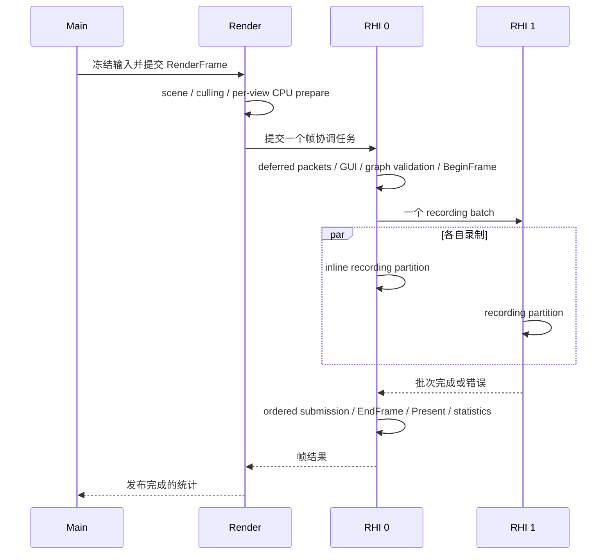

# 保留渲染准备结果与帧调度优化

Renderer 保留可复用的准备结果，并通过明确的任务等待与 GPU fence 保证跨帧资源所有权。

## 保留与刷新

- `SceneBridge` 消费逻辑 scene 的变更记录，仅检查使用可编辑材质的 attachment 的版本。完全静态的就绪场景不再遍历所有模型；场景宿主状态由 bridge/status 和资源发布版本共同失效。
- Render scene 为稳定的内置 primitive 发布 collection revision。`SessionViewCache` 同时检查 scene/resource revision、实际 culling/sort 矩阵、view/family、viewport（包含深度范围）、视图参数、附件和材质依赖。静态视图复用 collection、resolved material、batch plan 和内容标识。关闭 culling 的不透明视图可以在相机移动时保留 collection，但仍更新依赖 View 的参数。自定义 primitive 默认不声明稳定，Frame/Pass/Draw 依赖和自定义 batch strategy 保留原有求值路径。
- 相机更新时，同一个 view 的材质 evaluation 共享不可变的 engine scope block；Object/Material/Draw 保持各自所有权。提交新结果时替换共享 block，避免逐项复制全部 scope key/lifetime。旧帧引用旧值，覆盖层和 scope block 不串联历史帧。
- `ScenePassCache` 根据 Render 内容标识和资源发布版本保留不可变 draw vector。Graph 的 consume 路径和 `RecordOwned()` 传递同一份数据。缓存命中后按本帧实际视图顺序重新发布成功回执，确保视图换序或移除时 `DrawResult` 的 frame/family/view 仍正确。
- D3D12 为每个 recording context 保留弱所有权的原生操作计划。首次完整验证通过后，重复的不可变 stream/附件组合可以编译并复用必要的 PSO、geometry、root、heap、CBV、table、dynamic state 和 draw 操作序列。每条命令列表仍设置其初始状态，并记录所有实际 draw API。借用式 `Record()` 继续快照并完整验证；新 stream、目标变化、错误 geometry 或资源仍走检查。
- 原生计划不延长 GPU 资源生命期；不可变 stream 本身持有全部资源。常量页额外记录弱命令使用凭据，覆盖 shared stream 和 inline owned commands；登记、发布检查和 reset 使用同一页锁。`ResetConstantBuffer` 同时要求唯一 buffer 句柄与所有命令使用者失效，防止多层共享 owner 只包含一份嵌套句柄时提前重置。场景变更主动清除批次计划的参数所有权，普通 family 退休也会移除 emitted owner 失效的计划。
- Deferred scene/depth 准备持有现有资源协调器的 `FRenderResourcePreparation` 句柄；GUI 在执行时取得仍存活的 plugin 状态凭据。owner 关闭或销毁后，graph 在获取 GPU 帧前受控拒绝。首次 native Close 失败后可以重试剩余清理。
- 就绪 view 准备、未被资源实际使用的 Frame/Pass lifetime 释放不再调度维护。创建、上传、失败、资源释放和待完成 fence 仍驱动维护。静态 CSM 还复用 caster/projection setup；缓存键包含真实 camera/light/settings 和 scene/resource revision。没有 revision 的动态查询接口继续查询。四个 cascade 每帧照常渲染。

相关实现入口：[SessionViewCache.cpp](../Source/Runtime/Renderer/Private/SessionViewCache.cpp)、[ScenePassCache.cpp](../Source/Runtime/Renderer/Private/ScenePassCache.cpp)、[SessionMaterialEvaluation.cpp](../Source/Runtime/Renderer/Private/SessionMaterialEvaluation.cpp)、[D3D12DrawPlan.cpp](../Source/Backends/D3D12/Private/D3D12DrawPlan.cpp)。

## 新的帧同步边界

```mermaid
sequenceDiagram
    participant Main
    participant Render
    participant RHI0 as RHI 0
    participant RHI1 as RHI 1
    Main->>Render: 冻结输入并提交 RenderFrame
    Render->>Render: scene / culling / per-view CPU prepare
    Render->>RHI0: 提交一个帧协调任务
    RHI0->>RHI0: deferred packets / GUI / graph validation / BeginFrame
    RHI0->>RHI1: 一个 recording batch
    par 各自录制
        RHI0->>RHI0: inline recording partition
        RHI1->>RHI1: recording partition
    end
    RHI1-->>RHI0: 批次完成或错误
    RHI0->>RHI0: ordered submission / EndFrame / Present / statistics
    RHI0-->>Render: 帧结果
    Render-->>Main: 发布完成的统计
```

逐帧汇合的宿主使用一个 Main→Render wait、一个 Render→RHI wait。两个 RHI executor 时，协调任务再统一 join 一个 peer；CSM 的多个 pass 不会增加逐 pass dispatch/wait。RHI 0 自己的 partition 直接执行。GUI、depth preview 和 RenderDoc 的帧前/帧后操作进入相同协调边界。仍支持原来的 immediate API，外部调用它时仍可产生自己的同步。

Graph 在 BeginFrame 前展开并验证 deferred entries，正确翻译展开后的依赖索引。录制失败时先 join 所有已接收的 peer，再 cancel frame，保留最初错误并允许下一帧重试。低 draw 时的 GPU frame-slot fence 和 Present 等待仍然存在；减少 CPU 排队不会使这些等待自动消失。

GPU timing submission 带有 capture epoch，只有当前 epoch 的完成结果进入本次 capture。上一次 capture 或采集开始前提交的帧只更新一般 GPU 统计，避免异步完成时串入本次样本。该边界由受控 queue gate 测试覆盖。

相关实现：[RenderGraphPreparation.cpp](../Source/Runtime/Renderer/Private/RenderGraphPreparation.cpp)、[RenderGraphExecution.cpp](../Source/Runtime/Renderer/Private/RenderGraphExecution.cpp)、[EditorFrame.cpp](../Source/Plugins/Editor/Private/EditorFrame.cpp)。

性能采集入口与当前 Editor 工作负载约束见 [渲染诊断](RenderDiagnostics.md)。
