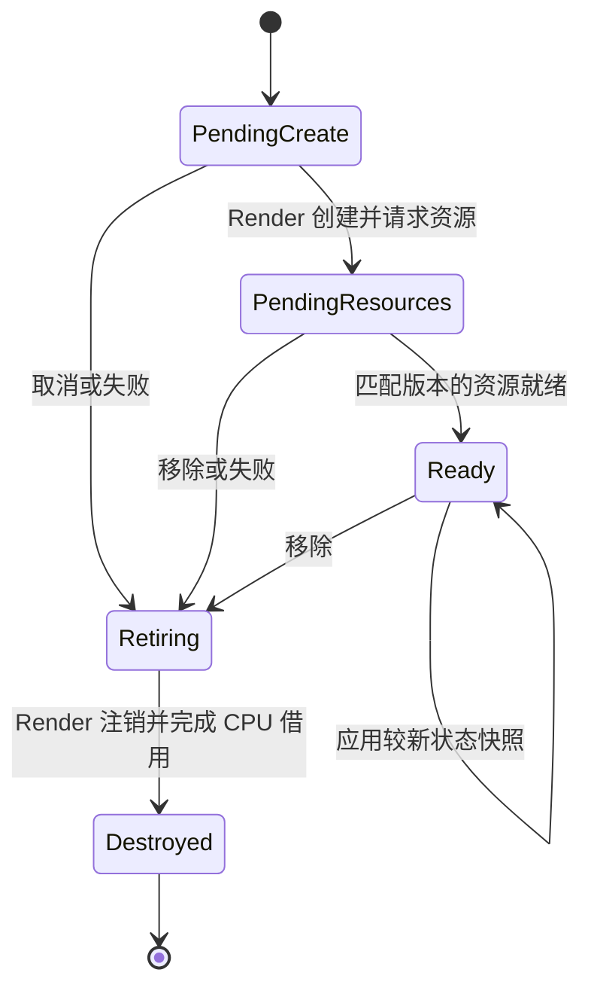

## Context

本 change 的 plan 已经用户审核确认，并明确授权推进到全部任务完成。当前为实施阶段。

现有代码已经区分 Main、Render、indexed RHI、Worker 和 IO，但模型运行时尚未按线程所有权分层：

| 现状与代码入口 | 对本次设计的影响 |
| --- | --- |
| `Scene/Model.h` 中 `FModelAsset` 是 CPU 资产，`FModelInstance` 是 primitive 索引与世界矩阵 | 不把资产类型改成 Main 对象或 GPU proxy，不改变反射格式 |
| `Renderer/ModelRenderer.h` 规定 `FModelRenderer` 方法在 RHI coordinator 执行 | 拆出 Render 侧实例/收集与 RHI 侧资源操作，不只重命名类 |
| `ModelRenderer.cpp` 在对象内创建 VB/IB、管线并局部排序 | 引入跨实例共享与跨模型统一绘制组织 |
| `ModelViewerPlugin.cpp` 在模型 pass 设置 `bClearDepth` | 清深度交给场景 pass，避免多个模型相互清除深度 |
| `ViewerFrame.cpp` 等待每次 Render 工作完成，插件同时承载输入和渲染状态 | 保留首版帧调度，但新的线程边界依靠消息和自有快照 |
| `TaskSystem.cpp` 跳过失败依赖的任务体，关闭后拒绝新任务；Dispatch 使用 `std::function` | cleanup 不使用成功依赖，Main 不传输已构造的 unique proxy |
| D3D12 录制列表/帧保活 draw 资源；普通 RHI 句柄采用 `shared_ptr` | 保留 GPU fence 机制，并保证移除 proxy 不导致底层对象在 Render 意外最后释放 |

现有架构文档要求 Scene/Animation 不依赖 Renderer/RHI，RHI 0 串行处理资源和队列操作。新设计遵守该边界，原生 API 继续留在 backend 私有实现。

## Goals / Non-Goals

**Goals:**

- 建立应用无关的持久 primitive 协议，让不同 Main 对象体系和 Render 对象体系独立扩展。
- Main 通过通用绑定提交自有数据；Render 独占 proxy，统一收集并组织场景绘制。
- 多个模型实例复用几何和兼容材质资源，变换、可见性与材质覆盖互不干扰。
- 为正常移除、异步失败、上传中取消、帧错误和关闭定义可验证的完整生命周期。
- 将 ModelViewer、Triangle 迁移到同一流程，保留现有可见行为和外部接口。
- 把关键原则写成架构文档及可执行验收场景。

**Non-Goals:**

- 不实现 GPU instancing、indirect drawing、GPU culling、draw-command 持久缓存或 instance buffer 分配器；只提供不会阻碍它们的数据边界。
- 不实现骨骼/动画、粒子、地形、LOD 系统、阴影、光追、通用离屏 RenderGraph 或新 backend。
- 不开启 Main/Render 帧重叠，不改写 Tasks 调度器及失败依赖语义。
- 不建立完整 ECS/World、通用组件框架或独立 SceneRendering 模块。
- 不改变 glTF 支持范围、资产格式、CLI、插件 ID、现有 target/可执行文件名；不把 GUI、清屏或计算工作伪装成场景 primitive。
- 不增加多模型编辑 UI 或新的 CLI；多模型能力通过 Runtime 接口与集成测试验证。

## Decisions

### 1. 持久代理、帧描述和 RHI draw 分层

采用 `IRenderPrimitive` 抽象接口，首个生产实现为 `FStaticMeshRenderPrimitive`。proxy 与 render primitive 在首版表示同一层，不再增加只做转发的 ModelRenderProxy。

primitive 是可独立注册、更新、移除的持久渲染单元，不等同于资产中的几何，也不固定对应一次 draw。首版模型映射为选中场景的每次节点实例与每个 glTF primitive/section 的组合；多个节点引用同一几何形成多个 proxy。收集接口允许输出零个或多个 `FRenderItem`，为未来多 section、多 pass 和批处理保留空间。

`FRenderItem` 包含几何/section 引用、材质版本、实例参数、保守包围体及所需的渲染类别。View、目标与 pass 级数据来自 `FRenderView`/frame context，不复制到持久 proxy。Renderer 将 item 转换为具体 pass 的 RHI draw。首版允许普通 draw，不承诺减少 draw 数量。

收集函数只读取已应用的状态，不推进动画、不更新游戏状态、不直接录制原生命令、不创建每对象 pass。RHI 任务消费自有描述与资源租约，不解引用 proxy。未来并行收集只能读取受生命周期保护的冻结状态。

选择理由：把 primitive 永久定义为一次 draw，会阻碍剔除、多 pass 和 instancing；直接把 proxy 交给 RHI 则会重新引入跨线程对象借用。

### 2. Main 包装与资源类型归属

| 建议类型 | 线程与职责 |
| --- | --- |
| `FModelAsset` | Scene 中的不可变 CPU 资产，格式和反射不变 |
| `FModel` | Main 侧模型实例包装，组合资产引用、实例状态和一组绑定；不是新的资产类型 |
| `FRenderSceneClient` / `FRenderBinding` | Main 入口和 move-only 注册凭证，携带句柄、队列端点及关闭状态，不持有 proxy 指针 |
| `FRenderPrimitiveHandle` | 场景身份、槽位和 generation，跨线程仅作为身份值 |
| `FRenderScene` | Render 独占的注册表、状态应用和收集入口，内部独占拥有 proxy |
| `IRenderPrimitive` | Render 侧可变实例状态和收集接口；允许不同派生类型 |
| 几何/材质资源记录 | 分离共享内容和实例状态；资源状态由 Render/RHI 协议发布 |
| `FRenderItem` / frame snapshot | 当帧自有描述与租约，可在 proxy 移除后继续完成已开始的帧 |

Main 包装与 Render 派生类型无需一一对应，也不要求共同基类。资产和通用数学值可以跨线程只读共享；Main 可变逻辑对象禁止被 Render 访问。

本次 Main 渲染包装与资产到渲染描述的桥接放在 `Runtime/Renderer` 的独立公共接口/私有子目录，继续使用 `hyperion_render` target。Scene/Animation 保持独立；以后若把纯逻辑 Model 放入 Scene，其渲染绑定必须仍由上层组合，而不能把 Renderer 依赖带入 Scene。

选择理由：现在新增独立桥接模块会扩大构建迁移；把 `FModelAsset` 改成 wrapper 会破坏资产独立性和持久化语义。实际新增文件遵循 CodingStyle 的 F/I/E/T、PascalCase 和布尔 b 前缀规则。

### 3. 命令队列、身份与帧一致性

Main 通过 `CreatePrimitive`、`UpdatePrimitive`、`RemovePrimitive` 和批量提交入口交接描述。这些名称表示接口职责，具体签名在实现中按本协议收敛。

- Main 入口为同一场景分配带 generation 的句柄及单调递增命令序号；Render 注册表负责其有效性。不得依靠裸地址或可能复用的槽位判断身份。
- 正常对象更新由 Main 发布；Worker/RHI 的完成事件只携带句柄、generation、资源/请求版本和自有结果，不直接修改 proxy。
- 每次状态更新是相关字段的完整快照，含单调 revision。旧 revision 不覆盖新状态；资源结果必须匹配当前请求版本。
- 一个 Model 的多 section 变换更新在一个不可拆分 batch 内应用。校验/准备失败时不发布一半更新。
- 在 `BeginRenderFrame` 确定消费边界，按逻辑序号应用此前提交的命令，再固定本帧状态。边界后的更新进入下一帧；命令真正入队的线性化时刻定义先后。
- Render 队列的 FIFO 不代替上述协议：带依赖任务可能晚于后发任务就绪。业务命令进入统一 mailbox，在 Render 边界统一处理。
- 控制命令有独立的 Render pump，不依赖 BeginFrame/Present：最小化、无可用窗口或停止出帧时，创建结果、移除和关闭仍可在安全 CPU 边界推进。该 pump 不改变已冻结的帧；更新只影响下一次收集。
- 所有参数为值、owned buffer 或不可变共享快照。禁止捕获 Main 对象、可变容器视图、借用的栈引用。
- 状态、错误及移除完成回执通过 Main 可读的异步结果/消息发布。回执不持有 Main 对象，不要求 Render 等待 Main 执行回调。
- Main 包装只改变本地状态和提交命令。View、必要渲染设置、GUI 数据同样按自有 frame snapshot 交接；保留每帧 CPU wait 只是调度选择。

最小类型扩展采用在 Render 调用的创建入口/工厂，输入只含冻结描述和引擎资源身份，返回独占 proxy。不能以工厂回调为通道捕获 Main 对象；工厂所属代码和资源存活到已接收的创建工作结束。首版不设计通用插件热卸载系统。

选择理由：仅用 dispatch 加裸指针无法处理迟到结果和对象复用；每对象锁不能提供跨 section 的帧一致性。

### 4. 默认 Render 构造，生命周期有明确终点

首版只在 Render 创建、注册及析构完整 proxy。Main 构造的是描述符，避免 move-only lambda 与当前 `std::function` 的兼容问题，也避免提交被拒后在 Main 析构完整 proxy。

状态包含相应的错误/取消结果。尚未完成构造就失败时，不要求调用未构造对象的析构函数；已成功构造的对象必须在 Render 恰好析构一次。

移除立即使 Main 绑定停止接受更新；Render 消费移除后禁止后续帧收集该对象。重复移除及过期 generation 安全无效；移除回执表示对象已不再供 Render 使用，不表示 GPU 已空闲。已冻结的旧帧仍可完成，其快照必须自足。

PendingResources 对象可以先注销、析构。资源上传由独立请求记录接管，迟到的成功/失败结果只完成请求或回收资源，不能重建已销毁对象。移除不等待整个共享资产的其他使用者退出。

普通更新错误不跳过后续移除。处理状态以结果数据发布，cleanup 工作不直接依赖可能失败的 task handle；必须通过错误已被观察的边界、独立清理任务或 scope guard 执行。不修改 Tasks 对普通依赖的既有失败传播行为。

选择理由：Main 构造完整 proxy 是可行扩展，但没有必要在首版增加所有权交接失败分支。用普通跨线程 `shared_ptr<IRenderPrimitive>` 会失去析构线程保证。

### 5. 共享几何、材质与上传发布

资源共享由引擎的设备级资源服务处理，不由每个 ModelViewer 或 Model 建立独立 GPU 副本。

- 几何键包括不可变资产身份/版本、primitive/section 或几何范围、顶点准备配置、资源表示和设备身份。首版可为同一个仍受保活的不可变资产分配注册身份，不使用可被复用的裸地址作永久 ID。
- 同一资产的并发准备/上传请求合并。失败后允许新请求重试；一位请求者取消不取消其他仍有效的使用者。设备或准备配置不同，不共享不兼容资源。
- 不要求对独立反序列化但内容相同的两份资产做内容级去重，也不实现文件热重载、LRU 或资产 cooking。
- 材质共享分离定义/纹理/兼容管线与实例覆盖。单个实例的覆盖通过新版本或实例快照表达，不能原地修改其他实例正在使用的内容。
- 纹理键保留色彩空间和使用角色；管线兼容性保留 vertex layout、深度/混合/剔除、镜像绕序及 shader 变体。复用不能改变现有渲染语义。
- Worker 准备 CPU 顶点/mip/shader 数据；RHI 0 创建原生资源和上传；Render 仅消费线程安全发布的就绪/失败结果，不在 Render 调用设备资源方法。
- 未就绪对象不产生引用不完整资源的 draw。首版模型初次显示按整组所需资源就绪后发布，以保留当前加载体验；已就绪模型的资源替换在对应新版本完整就绪后切换。

选择理由：同一个文件不足以证明资源或 draw 兼容；将实例变换与 GPU 几何绑定在一个对象内会重复上传，并妨碍单实例覆盖。

### 6. Render 对象释放与 RHI/GPU 回收分离

RenderScene 拥有 proxy 的独占指针；proxy 和 frame item 持有资源租约/身份，不能成为底层 RHI payload 在任意线程最后释放的偶然位置。

采用设备级资源 coordinator 保留权威 RHI 句柄，并接收线程安全的退休请求。Render 侧描述/租约可以在自己的线程释放；实际底层销毁由 RHI 0 执行。发给 RHI 的 frame/upload 工作必须带独立保活，不再借用 proxy。

资源退休同时满足：没有可重新获取该版本的活动绑定；所有已接收的 CPU 资源使用结束；录制/提交数据的引用结束；上传与绘制 fence 均允许回收。GPU 保活继续使用现有上传批次、recorded list 和 frame ring；新增 coordinator 负责填补未提交、最后一个 Render 引用、上传失败等回收路径，不能只延迟固定帧数。

实现中必须明确权威句柄与帧引用的释放顺序，不能仅因 proxy 租约计数归零就删除底层对象。未绘制过的资源也要在 RHI 0 回收；正常移除/采集不调用全局 `WaitIdle()`。队列和设备服务在所有相关引用释放前保持有效，不能在析构中向已关闭的 Tasks 再派发工作。

完成事件/内部进度任务也要在无新可呈现帧时驱动 coordinator 采集。已完成的 upload/frame 保活记录不能仅等待下一次 frame-ring 复用才清理；测试须在释放 GPU gate 后、不再提交新帧的条件下观察退休完成。

该协调协议限定于新 Renderer 管理的资源及迁移后的路径。保留公共 RHI 已有的独立设备/资源生命周期、foreign payload 校验以及 payload 可延长底层 device state 生命周期的行为，不用本 change 强制重写所有直接 RHI 客户端。公共接口只补充所需的引擎回收/完成接缝，原生对象留在 backend 私有代码。

选择理由：普通 shared_ptr 保证引用计数，不保证析构域；每对象 WaitIdle 虽简单但阻塞全部实例；仅依赖已提交帧保活漏掉从未绘制及上传中移除的资源。

### 7. RenderScene 统一组织场景绘制

Renderer 在 Render 上应用状态、过滤隐藏/未就绪对象、收集 item、按视图和渲染类别组织 pass。首版保存保守 bounds 并完成视锥外过滤；没有有效可证明剔除的 bounds 时保守保留，不实现遮挡或 GPU culling。

opaque/mask 与 blend 遵循现有材质状态。透明 item 在共享视图/目标的场景范围内稳定地按中心投影深度从后向前排序，不按 Model 分组各自排序。镜像变换和双面模式保留管线选择语义。中心排序不解决相交透明面；三角形已有的无深度/自定义 shader 行为按其渲染状态保留。

场景 pass 统一决定首次深度初始化和后续 load；对象不清屏、不清深度，也不拥有独立 graph pass。保持当前 color + optional depth 图范围和 context 容量检查。GUI 仍在场景之后使用自己的 copied draw data 和 pass；clear、present 及未来非场景工作沿用 pass 层。

具体 buffer 分配、常量上传及 RHI packet 物化仍在 RHI 0。可以按帧/资源批次交接，避免每个 primitive 同步 dispatch/Wait；indexed RHI 仅录制独立上下文，最终提交由 RHI 0 完成。

选择理由：每个 Model 自己排序/清深度无法保证跨模型正确性；每 primitive 一个 pass 还会耗尽当前录制上下文。

### 8. 为 instancing 留数据边界，不在首版实现

共享几何与 draw 合并是不同能力。item 分离稳定 geometry/material/状态与实例变换，保留资源版本、section 范围、布局、shader/材质绑定、变形模式和镜像/混合状态等兼容信息。

未来合批由 Renderer 在可见性/LOD 选择后完成，实例 buffer 和可复用区间由 Renderer/RHI 管理，不由多个 proxy 互相持有或修改。当前 D3D12 `DrawIndexedInstanced` 的 instance count 仍为 1；不新增 instance stream、GPU instance buffer 或“已实现 instancing”的性能声明。

选择理由：保持 1:N / N:1 描述关系足以避免架构锁死；同时实现完整 instancing 会扩大 shader、RHI 和透明排序验证范围。

### 9. 插件、Viewer 与关闭顺序

引入引擎拥有的渲染 session，明确 Main facade、RenderScene 和 RHI 资源服务的生命周期。Main 侧 ModelViewer 负责加载请求、相机输入和状态展示，通过通用 `FModel`/绑定发布实例。Triangle 提供程序化几何及其材质描述，也通过同一 primitive 注册/收集，不走资产加载专用入口。

插件的生命周期与执行域显式区分，不能沿用当前所有插件都在 RHI 0 Activate/Stop 的假设。已有 GUI/资源插件需要的 RHI 阶段通过明确的 coordinator 工作完成。保留稳定配置 ID、启用/禁用行为及依赖顺序；引擎不能反向依赖具体插件。

关闭顺序：

1. Main 停止帧与外部对象更新生产者，关闭客户端 admission；既有绑定安全失效。
2. 在 Tasks 仍接收内部清理工作的期间启动 Render 关闭控制流程，持续处理已接收命令；取消并由 Main 编排等待资产准备/上传生产者和创建结果，观察异常。不能停止出帧后等待一个仅由下一帧消费的创建请求。
3. Render 执行移除/关闭屏障，注销全部 primitive，结束 CPU 借用并在 Render 析构；排空 frame/资源完成事件。
4. RHI join 已接收的录制/上传操作，按现有帧错误路径取消活动帧，完成 GPU drain，回收 Renderer 资源和 GUI 等图形资源。
5. RHI 释放 swapchain/device，随后关闭剩余服务和 Tasks。关闭后的 Main 绑定析构只释放失效的客户端状态，不再派发工作。

异常关闭也完成上述可执行阶段，保留原始错误，并报告无法 drain 的设备错误。不得因为前一阶段失败直接丢弃仍被使用的资源。

等待方向保持单向：Main 编排跨域完成，Render 必要时等待 RHI，RHI 不等待 Render，任何 dedicated domain 不等待同队列尚未完成的任务。需要回到 Render 的资源结果通过消息发布，不能形成 RHI 与 Render 的循环等待。

### 10. 文档与验证作为交付内容

实现阶段新增 `docs/RenderPrimitives.md`，记录类型关系、执行域、接口调用前置条件、帧一致性、生命周期、扩展及非场景边界；同步 Architecture、SourceLayout、AssetPipeline，删除被替换的整模型 RHI 绘制建议。

新增不依赖 ModelViewer/Triangle 的 Renderer 协议测试，使用受控执行队列、门控准备/上传和替身资源验证失败时序。现有真实 D3D12 图像和 fence 测试继续作为 GPU 证据。线程断言使用引擎执行域检查；如果 Tasks 缺少查询接口，仅添加最小只读检查，不增加新调度语义。

## Risks / Trade-offs

- [代理和资源生命周期交错] → 分离 proxy、资源请求、帧租约和回收记录，强制覆盖“从未绘制”和“上传中删除”。
- [失败依赖跳过清理] → 业务结果作为状态发布，清理不以失败任务作为成功前置条件；单独门控失败回归。
- [现有插件在多个线程访问同一 PImpl] → 将输入/相机、Render 状态和 RHI 资源分别归属，跨域状态通过快照/结果发布。
- [普通帧 wait 掩盖数据竞争] → 在测试中故意暂停 Render，让 Main 更新/销毁原输入，验证旧快照仍完整有效。
- [共享使单实例修改影响其他模型] → 不可变资源版本、独立实例覆盖及不同设备/配置的负向复用测试。
- [资源 pin 导致长期驻留] → 实现显式退休条件与 coordinator 采集；测试最后租约释放后的回收，不用“关闭时全部释放”代替正常生命周期。
- [粒度导致首版 proxy 数量多] → 按当前 section 映射以降低迁移复杂度；接口允许将来共享变形状态或多 section 输出。
- [跨模型排序改变原有图像] → 单模型保留基线；增加跨模型遮挡/透明像素测试，记录中心排序的既有限制。
- [直接 RHI 与新资源服务共存] → 明确服务管理范围，继续运行独立 RHI/device ownership 测试，避免不必要的全局句柄重构。

## Migration Plan

1. 用户确认本 plan 后才开始。先落地类型、执行域契约与协议测试；正式文档同步与实现一起完成。
2. 实现 Main mailbox、RenderScene、批量快照和移除/关闭协议，使用无 GPU primitive 验证线程与迟到事件行为。
3. 实现共享 CPU 准备/资源记录、RHI 0 上传与退休，再通过门控 GPU fence 验证生命周期。
4. 接入静态网格 item 和统一场景绘制，验证多模型共享、深度、透明、镜像及独立覆盖。
5. 迁移 ModelViewer、Triangle 和 Viewer session；保留 GUI pass 与旧接口兼容桥仅到调用方迁移完成，最终移除重复整模型提交路径。
6. 运行针对性回归，再完成 Debug/Release、格式/命名、边界、OpenSpec 和既有 Viewer/RenderDoc 验收；在 tasks 中记录实际验证，不预先勾选。

无需资产或配置迁移。回退以本 change 的实现提交为单位，恢复先前路径；不长期保留两个可选场景渲染系统。proposal 阶段仅新增当前 change 目录，不同步正式 specs 或改写实现文档。

## Open Questions

没有要求当前用户再次回答才能生成 artifacts 的问题。供 plan 审阅确认的具体选择为：

- 首版只在 Render 构造 proxy，暂不支持 Main 构造完整 proxy 后移交。
- Model 与渲染绑定放在现有 Renderer 模块的独立接口中，Scene/资产格式保持不变。
- 首版 glTF 按节点实例乘 section 建立 proxy，统一收集接口允许零到多个 item。
- 交付共享资源、CPU 视锥过滤、跨模型排序与完整回收；自动 instancing、骨骼、帧重叠留待后续 change。

上述选择已经用户确认；实现与验证进度以 tasks.md 为准。

## Implementation notes

- 实际控制流采用 admission 锁内线性化入队的、无依赖的专用 Render FIFO 作为统一 mailbox。没有另建重复队列或外部序号字段；generation/revision 与不可变资源版本提供身份和陈旧更新检测，frame task 确定消费边界。
- Main `FModel` 的初次注册使用 `CreateBatch`，多 section 更新使用同一 `Update` batch。资源组准备和上传整体发布；请求替换期间该组可以暂时隐藏，完整新版本就绪后才物化 draw，首版不增加旧版本持续显示策略。
- 对外结果用 PendingCreate/PendingResources/Ready/Failed/Removed；Retiring 是 Remove 已接收但回执未完成的阶段，Destroyed 对应 Removed 回执。CPU 资源租约在 session 关闭后查询 Retired。
- 共享单位为保活的不可变资产版本/配置资源组，section 索引区分组内几何和材质。失败重试具有独立 attempt 身份，仍然合并兼容重试。未实现内容去重或按独立 section 的跨资产缓存。
- RHI 新增非阻塞 CollectCompletedResources 接缝，D3D12 成功提交后的 recorded lists 由设备级 fenced 集合保活，填补无后续帧时的退休路径。GPU 查询失败保留权威所有权；pending producer 被 join 后方能删除记录。
- 新的 FModel、RenderScene、ResourceService、RenderSession 均在现有 Renderer target；原有 FModelRenderer 已删除。IScenePlugin 的 Start/Update/Stop 在 Main，IRenderPlugin::Build 用于 Render 非场景 pass。
- 线程检查维持 Tasks 既有能力：同专用队列等待拒绝，跨队列循环由 Main → Render → RHI 的协议禁止，不新增通用等待图检测。
